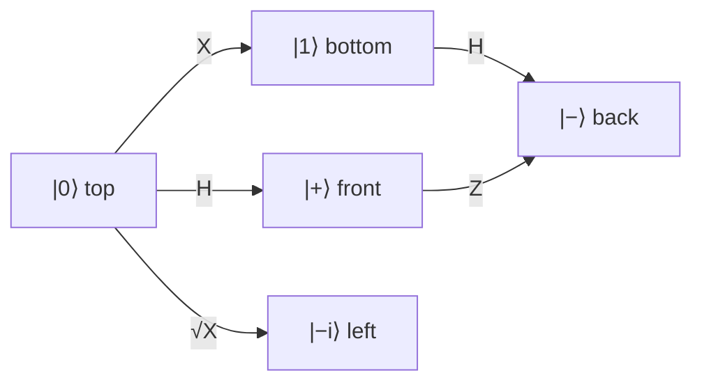

#bloch_sphere #qubit
## What it is
a way to draw **any** single qubit state as a point on a sphere
$$
|\psi\rangle=\cos\frac{\theta}{2}|0\rangle+e^{i\varphi}\sin\frac{\theta}{2}|1\rangle
$$
- $\theta$ → how far down from the top (north pole) you go
- $\varphi$ → how far around the equator you go (this is the phase)

![[Bloch_sphere.png|500]]
## Where the states are
| axis | states |
|---|---|
| $z$ (up/down) | $\lvert0\rangle$ top, $\lvert1\rangle$ bottom |
| $x$ | $\lvert+\rangle=\frac1{\sqrt2}(\lvert0\rangle+\lvert1\rangle)$, $\lvert-\rangle=\frac1{\sqrt2}(\lvert0\rangle-\lvert1\rangle)$ |
| $y$ | $\lvert{+i}\rangle=\frac1{\sqrt2}(\lvert0\rangle+i\lvert1\rangle)$, $\lvert{-i}\rangle=\frac1{\sqrt2}(\lvert0\rangle-i\lvert1\rangle)$ |

opposite points on the sphere are **orthogonal** states (you can tell them apart perfectly)
## Gates = rotations
every single qubit [[Quantum gate|quantum gate]] just rotates the sphere
- [[X gate]] → $180^\circ$ around the $x$ axis
- [[Y gate]] → $180^\circ$ around the $y$ axis
- [[Z gate]] → $180^\circ$ around the $z$ axis
- [[Hadamard Gate]] → $180^\circ$ around the axis halfway between $x$ and $z$ (swaps $|0\rangle\leftrightarrow|+\rangle$)
- [[Sqrt(X) Gate]] → $90^\circ$ around $x$
- [[Phase shift]] → $\varphi$ around $z$

(how the gates move you between the main states)

## Inside the sphere
- **surface** → pure states
- **inside** → mixed states ([[Density matrix]])
- **center** → the fully mixed state $\frac I2$

noise squishes the sphere inwards, see [[Quantum channels#what the Bloch sphere squishing actually means]]
