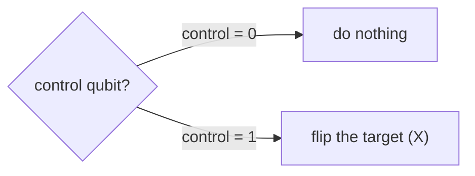

#gate #CNOT_gate #controlled_gate #entanglement
## What it does
It is a [[Quantum gate|quantum gate]] on 2 qubits: a **control** and a **target**
- control is $|0\rangle$ → do nothing
- control is $|1\rangle$ → apply an [[X gate]] to the target (flip it)

it's the main way to make **entanglement**: [[Hadamard Gate]] on the control then CNOT gives $\frac1{\sqrt2}(|00\rangle+|11\rangle)$



## Matrix
(order $|\text{control},\text{target}\rangle$)
$$
\text{CNOT}=\begin{bmatrix}1&0&0&0\\0&1&0&0\\0&0&0&1\\0&0&1&0\end{bmatrix}
$$

## On the Bloch sphere
![[CNOT_gate_bloch.png]]
each qubit gets its own sphere (see [[Multiqubit gates#on the Bloch sphere]])
- **top**: control is $|1\rangle$ → the target's arrow flips from top to bottom, like an [[X gate]]
- **bottom**: control is $|+\rangle$ → the output is a Bell state, which is entangled, so **both** arrows shrink to the middle (each qubit on its own is fully mixed)

## Qiskit implementation
```python
from qiskit import QuantumCircuit

qc = QuantumCircuit(2)
qc.cx(0, 1)   # control 0, target 1
```
> [!warning] Qiskit qubit order
> ==Qiskit writes states backwards ($|q_1q_0\rangle$) so the matrix Qiskit shows looks different from the one above, but it's the same gate==
## Visual representation
![[CNOT_gate.png]]
## Truth Table
$$
\begin{array}{c|c}
x & \text{CNOT}(x)\\
\hline
|00\rangle & |00\rangle\\
|01\rangle & |01\rangle\\
|10\rangle & |11\rangle\\
|11\rangle & |10\rangle
\end{array}
$$
(it's the same as target $\to$ target $\oplus$ control, the XOR from [[Modular arithmetic]])
## Example (making a Bell state)
![[Bell_state_circuit.png]]
step by step, starting from $|00\rangle$
$$
|00\rangle\xrightarrow{\ \text H\text{ on }q_0\ }\frac1{\sqrt2}(|00\rangle+|10\rangle)\xrightarrow{\text{ CNOT }}\frac1{\sqrt2}(|00\rangle+|11\rangle)
$$
the CNOT only flips the target in the $|10\rangle$ part, which turns it into $|11\rangle$

the result can't be split into (qubit 0) $\otimes$ (qubit 1) anymore, it's **entangled** (see [[Tensor product#entanglement]])

> [!tip] all 4 Bell states
> start from $|00\rangle,|01\rangle,|10\rangle,|11\rangle$ and do the same H + CNOT
>
> | start | Bell state |
> |---|---|
> | $\lvert00\rangle$ | $\frac1{\sqrt2}(\lvert00\rangle+\lvert11\rangle)$ |
> | $\lvert01\rangle$ | $\frac1{\sqrt2}(\lvert01\rangle+\lvert10\rangle)$ |
> | $\lvert10\rangle$ | $\frac1{\sqrt2}(\lvert00\rangle-\lvert11\rangle)$ |
> | $\lvert11\rangle$ | $\frac1{\sqrt2}(\lvert01\rangle-\lvert10\rangle)$ (the singlet from [[Quantum weirdness]]) |

## Properties
- $\text{CNOT}\cdot\text{CNOT}=I$ (its own inverse)
- with single qubit gates, CNOT can build **any** multi qubit gate (see [[Quantum gate#universal gate sets]])
- 3 CNOTs in a row (the middle one upside down) = a [[SWAP gate]]

see also [[Multiqubit gates]], [[X gate]], [[Bell states]], [[Entanglement entropy]]
