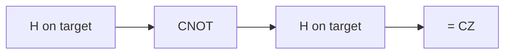

#gate #CZ_gate #controlled_gate
## What it does
It is a [[Quantum gate|quantum gate]] on 2 qubits
- control is $|1\rangle$ → apply a [[Z gate]] to the target
- so only $|11\rangle$ gets a minus sign, everything else stays the same

it doesn't matter which qubit is the control, the result is the same
## Matrix
$$
\text{CZ}=\begin{bmatrix}1&0&0&0\\0&1&0&0\\0&0&1&0\\0&0&0&-1\end{bmatrix}
$$


(building a CZ out of a CNOT)

## On the Bloch sphere
![[CZ_gate_bloch.png]]
- **top**: control is $|1\rangle$ → the target gets a [[Z gate|Z]], so $|+\rangle$ flips to $|-\rangle$ (front to back)
- **bottom**: $|+\rangle|+\rangle$ → CZ entangles them, so both arrows shrink to the middle

## Qiskit implementation
```python
from qiskit import QuantumCircuit

qc = QuantumCircuit(2)
qc.cz(0, 1)
```
## Visual representation
```visual
q_0: ─■─
      │
q_1: ─■─
```
## Truth Table
$$
\begin{array}{c|c}
x & \text{CZ}(x)\\
\hline
|00\rangle & |00\rangle\\
|01\rangle & |01\rangle\\
|10\rangle & |10\rangle\\
|11\rangle & -|11\rangle
\end{array}
$$
> [!tip]
> $\text{CZ}$ = [[Hadamard Gate|H]] on the target, then [[CNOT gate|CNOT]], then H on the target again

see also [[Multiqubit gates]], [[CNOT gate]], [[Z gate]]
