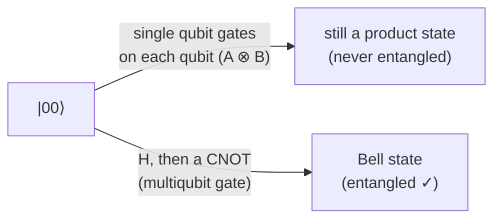
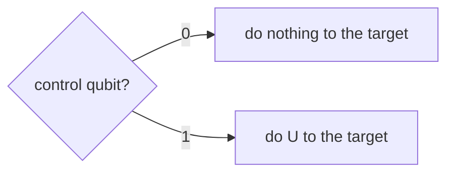
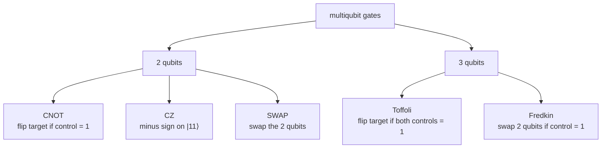

#gate #multiqubit_gate #controlled_gate #entanglement
[[Quantum gate|quantum gates]] that act on **2 or more qubits at once**. they're what let qubits affect each other
## why we need them
[[Quantum gate#Single qubit gates|single qubit gates]] only change one qubit on its own. doing a single qubit gate on each qubit ($A\otimes B$, see [[Tensor product#for gates]]) can **never** create entanglement

(checked numerically: random single qubit gates always leave $|00\rangle$ with Schmidt number 1, H + CNOT gives 2, see [[Schmidt number]])

> [!important] no multiqubit gates = no quantum advantage
> without them every qubit would just be its own separate little system. entanglement, and so things like [[Shor's algorithm]], [[Quantum Phase Estimation]] and [[Teleportation]], all need multiqubit gates
## matrix size
every extra qubit **doubles** the size of the matrix

| qubits | matrix | example |
|---|---|---|
| 1 | $2\times2$ | [[X gate]] |
| 2 | $4\times4$ | [[CNOT gate]] |
| 3 | $8\times8$ | [[Toffoli gate]] |
| $n$ | $2^n\times2^n$ | |

## controlled gates
most multiqubit gates are **controlled** gates: a **control** qubit decides whether a gate $U$ happens to the **target** qubit

as a matrix
$$
\text{C-}U=|0\rangle\langle0|\otimes I+|1\rangle\langle1|\otimes U=\begin{bmatrix}I&0\\0&U\end{bmatrix}
$$
the top left block does nothing (control is 0), the bottom right block does $U$ (control is 1)

| $U$ | controlled gate |
|---|---|
| [[X gate\|X]] | [[CNOT gate]] |
| [[Z gate\|Z]] | [[CZ gate]] |
| [[Phase shift\|P(φ)]] | controlled phase, used in the [[Quantum Fourier Transform]] |
| X with 2 controls | [[Toffoli gate]] |
| multiply by $a$ mod $N$ | the controlled gates in [[Modular Exponentiation]] |

> [!note] in a circuit
> a **dot** on the control qubit, joined by a line to the gate on the target
> ```visual
> q_0: ──■──
>      ┌─┴─┐
> q_1: ┤ U ├
>      └───┘
> ```
### the control isn't just a switch
if it's in a **superposition**, the gate happens and doesn't happen **at the same time**. that's how CNOT makes a Bell state from $|+\rangle|0\rangle$

it can even work backwards: with the right target, a controlled gate changes the **control** qubit instead. eg. $\text{CZ}\,|+\rangle|1\rangle=|-\rangle|1\rangle$ (checked numerically). this is called [[Phase kickback|phase kickback]], and it's the trick inside [[Quantum Phase Estimation]]

## on the Bloch sphere
the [[Bloch sphere]] only shows **one** qubit, so for a multiqubit gate each qubit gets **its own** sphere

![[CNOT_gate_bloch.png]]
> [!important] entangled qubits shrink to the middle
> - if the qubits are **not** entangled, each one is still a pure state, so its arrow reaches the surface and you can see exactly what happened to it
> - if the gate **entangles** them, each qubit on its own is a **mixed** state (see [[Density matrix#purification]] and [[Entanglement entropy]]), so its arrow gets **shorter**. fully entangled = arrow shrinks all the way to the middle (the red dot)
>
> so the length of each arrow is a quick way to **see** entanglement

each gate's note has its own picture: [[CNOT gate]], [[CZ gate]], [[SWAP gate]], [[Toffoli gate]]

## the gates

- [[CNOT gate]] → the most important one, makes entanglement
- [[CZ gate]] → like CNOT but with a phase. it doesn't matter which qubit is the control
- [[SWAP gate]] → swaps 2 qubits (not a controlled gate, but can be built from 3 CNOTs)
- [[Toffoli gate]] → a reversible AND, can do any classical computation
- [[Fredkin gate]] → a controlled SWAP
## how they fit together
- any circuit can be built from **single qubit gates + CNOT** (see [[Quantum gate#universal gate sets]])
- so bigger gates like Toffoli get broken down into CNOTs and single qubit gates when run on real hardware
- 2 qubit gates are usually the **slowest** and **noisiest** part of a real quantum computer, so good circuits try to use as few as possible

> [!warning] qubit order
> textbooks write $|q_0q_1\rangle$ but Qiskit writes $|q_1q_0\rangle$ (backwards), so the same gate can have a different looking matrix in Qiskit (see [[CNOT gate]])

see also [[Quantum gate]], [[Quantum gate#Single qubit gates|single qubit gates]], [[Tensor product]]
