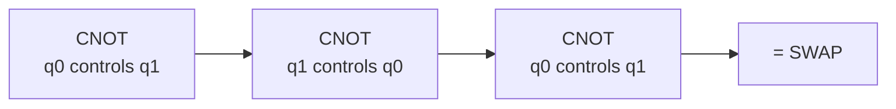

#gate #SWAP_gate
## What it does
It is a [[Quantum gate|quantum gate]] on 2 qubits
Swaps the states of the 2 qubits

used at the end of the [[Quantum Fourier Transform]] to put the qubits back in the right order
## Matrix
$$
\text{SWAP}=\begin{bmatrix}1&0&0&0\\0&0&1&0\\0&1&0&0\\0&0&0&1\end{bmatrix}
$$


(building a SWAP out of CNOTs)

## On the Bloch sphere
![[SWAP_gate_bloch.png]]
the easiest one: the 2 arrows just **trade places**. SWAP never creates entanglement on its own

## Qiskit implementation
```python
from qiskit import QuantumCircuit

qc = QuantumCircuit(2)
qc.swap(0, 1)
```
## Visual representation
![[SWAP_gate.png]]
## Truth Table
$$
\begin{array}{c|c}
x & \text{SWAP}(x)\\
\hline
|00\rangle & |00\rangle\\
|01\rangle & |10\rangle\\
|10\rangle & |01\rangle\\
|11\rangle & |11\rangle
\end{array}
$$
> [!tip]
> a SWAP is the same as 3 [[CNOT gate|CNOTs]] in a row (the middle one upside down)

see also [[Multiqubit gates]], [[CNOT gate]], [[Quantum volume]]
