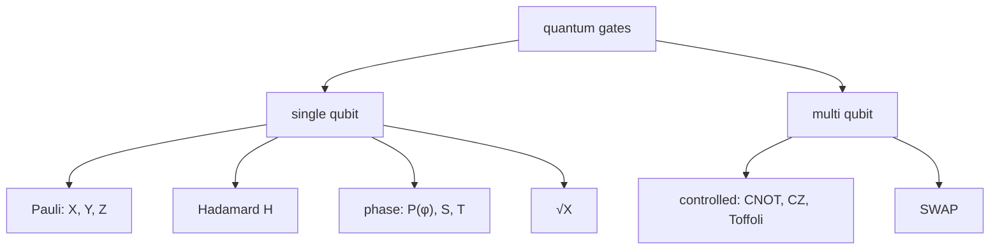

#gate
## What it is
A quantum gate is an operation on qubits, like logic gates (AND, OR, NOT) in a normal computer

Every quantum gate is a [[Unitary Operation]] so it can be written as a matrix
- 1 qubit → $2\times2$ matrix
- 2 qubits → $4\times4$ matrix
- $n$ qubits → $2^n\times2^n$ matrix

On the [[Bloch sphere]] a single qubit gate is just a **rotation** of the sphere
> [!important] quantum gates are always reversible
> because they're unitary you can always undo them (apply $U^\dagger$). normal gates like AND aren't reversible, if AND gives 0 you can't tell what went in


(the gate family tree)

## Single qubit gates
- [[Identity gate]]
- [[X gate]]
- [[Y gate]]
- [[Z gate]]
- [[Hadamard Gate]]
- [[Sqrt(X) Gate]]
- [[Phase shift]] (and the $S$ and $T$ gates)
## Multiqubit gates
- [[CNOT gate]]
- [[CZ gate]]
- [[SWAP gate]]
- [[Toffoli gate]]
## Reading a circuit diagram
```visual
q_0: ┤ H ├──■──┤ M ├
            │
q_1: ──────┤ X ├┤ M ├
```
- each **line** is a qubit, and they all start in $|0\rangle$
- time goes **left to right**
- a **box** is a gate on that qubit
- a **dot** connected to another gate means "controlled": only do it if the dot's qubit is $|1\rangle$
- **M** (or a meter symbol) is a measurement, it turns the qubit into a normal bit

> [!note] gates don't commute
> order matters: $\text X\text Z\neq\text Z\text X$ (actually $\text X\text Z=-\text Z\text X$). in maths the gate you do **first** is written on the **right**: "H then X" is $\text X\,\text H\,|\psi\rangle$
## Universal gate sets
you don't need every gate, a small set can build (or get as close as you want to) **any** gate
- **H, T and CNOT** can approximate any quantum circuit
- **any single qubit gates + CNOT** can build any circuit exactly
- real hardware uses its own small set, eg. IBM uses $\sqrt{\text X}$, X, $R_z$ and a 2 qubit gate (see [[Sqrt(X) Gate]])

this is like how NAND alone can build any classical circuit
## Measurement is not a gate
- gates are [[Unitary Operation|unitary]] and reversible
- measurement **isn't**: it collapses the qubit to $|0\rangle$ or $|1\rangle$ with probabilities $|\alpha|^2$ and $|\beta|^2$ (the probability rule in [[Dirac notation]]), and you can't undo it
- that's why algorithms measure only at the **end**
