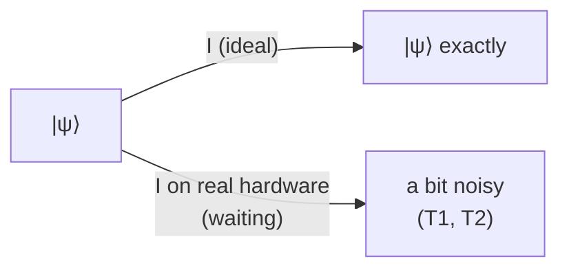

#gate #I_gate
## What it does
It is a [[quantum gate]]
Basically a buffer
Whatever comes in that same thing comes out not even with a [[Phase shift]]
on the [[Bloch sphere]] nothing moves
## Matrix
$$
\text I=\begin{bmatrix}
1 & 0
\\
0 & 1
\end{bmatrix}
$$
## Qiskit implementation
``` python
from qiskit import QuantumCircuit

qc = QuantumCircuit(1)
qc.id(0)
```
## Visual representation
``` visual
   ┌───┐
q: ┤ I ├
   └───┘
```
![[I_gate.png]]
## Truth Table
$$
\begin{array}{c|c}
x & \text I(x)\\
\hline
|0\rangle & |0\rangle\\
|1\rangle & |1\rangle
\end{array}
$$

## On the Bloch sphere
![[I_gate_bloch.png|500]]

## Why have a gate that does nothing?
- **waiting**: on real hardware "do nothing" still takes time, and while the qubit waits it slowly loses its state through noise ($T_1$ and $T_2$, see [[Noise Processes]] and [[Amplitude damping channel]]). the identity gate is how you tell the computer "wait here"
- **maths**: $I$ is what you get when a gate undoes itself, eg. $\text X\text X=I$, $\text H\text H=I$, and a [[Unitary Operation|unitary]] times its inverse $U^\dagger U=I$
- **multi qubit gates**: "do $\text H$ on qubit 1 and nothing on qubit 2" is $\text H\otimes I$ (see [[Tensor product]])
- the "do nothing" part of a noise channel, eg. the [[Depolarizing channel]] does $I$ with probability $1-p$


(ideal vs real hardware)

## Properties
- every state is an [[Eigenvalues and eigenvectors|eigenvector]] of $I$ with eigenvalue 1
- $\frac I2$ (half the identity) is the **fully mixed state**, the middle of the [[Bloch sphere]] (see [[Density matrix]])
