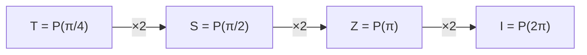

#gate #phase_shift #S_gate #T_gate
## What it does
It is a [[Quantum gate|quantum gate]]
Leaves $|0\rangle$ alone and multiplies $|1\rangle$ by $e^{i\varphi}$ (a phase)

On the [[Bloch sphere]] it rotates the state by $\varphi$ around the $z$ axis
## Matrix
$$
\text P(\varphi)=\begin{bmatrix}1&0\\0&e^{i\varphi}\end{bmatrix}
$$
## Special cases

| gate | $\varphi$ | matrix |
|---|---|---|
| [[Z gate]] | $\pi$ | $\begin{bmatrix}1&0\\0&-1\end{bmatrix}$ |
| S gate | $\frac\pi2$ | $\begin{bmatrix}1&0\\0&i\end{bmatrix}$ |
| T gate | $\frac\pi4$ | $\begin{bmatrix}1&0\\0&e^{i\pi/4}\end{bmatrix}$ |

the $R_k$ gates in the [[Quantum Fourier Transform]] are phase shifts too, with $\varphi=\frac{2\pi}{2^k}$


(doing a phase gate twice doubles the angle)

## On the Bloch sphere
![[Phase_shift_bloch.png|500]]
spins the sphere around the $z$ axis by $\varphi$. $|0\rangle$ and $|1\rangle$ are on the axis so they don't move, everything else goes around the equator
- S ($\varphi=\frac\pi2$): quarter turn, $|+\rangle\to|{+i}\rangle$
- T ($\varphi=\frac\pi4$): eighth of a turn
- [[Z gate|Z]] ($\varphi=\pi$): half turn, $|+\rangle\to|-\rangle$

## Qiskit implementation
```python
from qiskit import QuantumCircuit
from math import pi

qc = QuantumCircuit(1)
qc.p(pi/4, 0)   # any angle
qc.s(0)         # S gate
qc.t(0)         # T gate
```
## Visual representation
![[P_gate.png]]
## Truth Table
$$
\begin{array}{c|c}
x & \text P(\varphi)(x)\\
\hline
|0\rangle & |0\rangle\\
|1\rangle & e^{i\varphi}|1\rangle
\end{array}
$$
> [!note] global vs relative phase
> a phase on the **whole** state ($e^{i\varphi}|\psi\rangle$) does nothing you can measure. a phase on just **one part** ($|0\rangle+e^{i\varphi}|1\rangle$) is a real change, that's what this gate does

see also [[Z gate]], [[Quantum Fourier Transform]], [[Complex numbers]]
