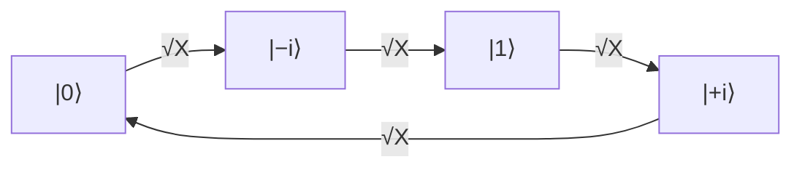

#sqrt_X_gate #gate
## What it does
It is a [[quantum gate]]
It's like if you do two of these then it will become a regular [[X gate]]
on the [[Bloch sphere]] it's a $90^\circ$ rotation around $x$
on real hardware it's a $\frac\pi2$ pulse, see [[Rabi oscillation]]
## Matrix
$$
\sqrt {\text X}=
\frac 1 2
\begin{bmatrix}
1+i & 1-i\\1-i & 1+i
\end{bmatrix}
$$
## Qiskit implementation
```python
from qiskit import QuantumCircuit

qc = QuantumCircuit(1)
qc.sx(0)
```
## Visual representation
![[Sqrt_X_gate.png]]
## Truth Table
$$
\begin{array}{c|c}
x & \sqrt{\text X}(x)\\
\hline
|0\rangle & \frac 1 2\big((1+i)|0\rangle+(1-i)|1\rangle\big)\\
|1\rangle & \frac 1 2\big((1-i)|0\rangle+(1+i)|1\rangle\big)
\end{array}
$$
## On the Bloch sphere
![[Sqrt_X_gate_bloch.png|500]]
a **quarter** turn around the $x$ axis, so $|0\rangle$ goes from the north pole down to the equator and lands on $|{-i}\rangle$
$$
\sqrt{\text X}|0\rangle=\tfrac{1+i}2\big(|0\rangle-i|1\rangle\big)\;\propto\;|{-i}\rangle
$$
(the $\frac{1+i}2$ in front is just a global phase)

2 quarter turns = a half turn = [[X gate]] ✅


(each √X is a quarter turn, so 4 of them bring you back)

## Properties
- $\sqrt{\text X}\sqrt{\text X}=\text X$
- $\sqrt{\text X}$ undone by $\sqrt{\text X}^\dagger$ (a quarter turn the other way)
- same [[Eigenvalues and eigenvectors|eigenvectors]] as X ($|+\rangle$, $|-\rangle$), with eigenvalues $1$ and $i$ (the square roots of X's eigenvalues $1$ and $-1$)
## Where it's used
> [!info] a "native" gate on real hardware
> IBM's quantum computers build every single qubit gate out of just $\sqrt{\text X}$, X and $R_z$ (a [[Phase shift|z rotation]]). when you run a circuit, Qiskit rewrites your H, Y, etc. into these

- it's a $\frac\pi2$ pulse, the quarter period of a [[Rabi oscillation]]

see also [[X gate]], [[Rabi oscillation]], [[Quantum gate]]
