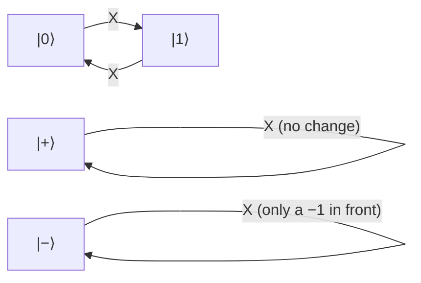

#gate #X_gate
## What it does
It is a [[quantum gate]]
A quantum version NOT gate so $|0\rangle$ to $|1\rangle$ and $|1\rangle$ to $|0\rangle$
on the [[Bloch sphere]] it's a $180^\circ$ rotation around $x$. on real hardware it's a $\pi$ pulse, see [[Rabi oscillation]]
(X, Y and Z are the **Pauli** gates, they're the errors in the [[Depolarizing channel]])
## Matrix
$$
\text X =\begin{bmatrix}
0&1\\
1&0
\end{bmatrix}
$$
## Qiskit implementation
```python
from qiskit import QuantumCircuit

qc = QuantumCircuit(1)
qc.x(0)
```
## Visual representation
![[X_gate.png]]
## Truth Table
$$
\begin{array}{c|c}
x& \text X(x)\\
\hline
|0\rangle & |1\rangle\\
|1\rangle & |0\rangle
\end{array}
$$
## On the Bloch sphere
![[X_gate_bloch.png|500]]
flips the sphere upside down around the $x$ axis, so the north pole ($|0\rangle$) goes to the south pole ($|1\rangle$)

$|+\rangle$ and $|-\rangle$ sit **on** the $x$ axis so they don't move at all (they're its [[Eigenvalues and eigenvectors|eigenvectors]])


(what X does to each state)

## Properties
- doing it twice undoes it: $\text X\text X=I$ (it's its own inverse)
- eigenvalues $+1$ and $-1$ with eigenvectors $|+\rangle$ and $|-\rangle$
- $\text X=\text H\,\text Z\,\text H$ (an X is just a [[Z gate|Z]] in the $|+\rangle,|-\rangle$ basis, see [[Hadamard Gate]])
## Example
works on superpositions too, it just swaps the two amplitudes
$$
\text X\big(\alpha|0\rangle+\beta|1\rangle\big)=\beta|0\rangle+\alpha|1\rangle
$$
eg. $\text X\left(\sqrt{\tfrac34}|0\rangle+\tfrac12|1\rangle\right)=\tfrac12|0\rangle+\sqrt{\tfrac34}|1\rangle$
## Where it's used
- the target of a [[CNOT gate]] and [[Toffoli gate]] (they're controlled X gates)
- flipping $|0\rangle$ to $|1\rangle$ to set up a qubit, eg. the work register in the [[Shor's algorithm]] demo starts with an X
- as an error it's a **bit flip**, one of the errors in the [[Depolarizing channel]]

see also [[Y gate]], [[Z gate]], [[CNOT gate]], [[Depolarizing channel]]
