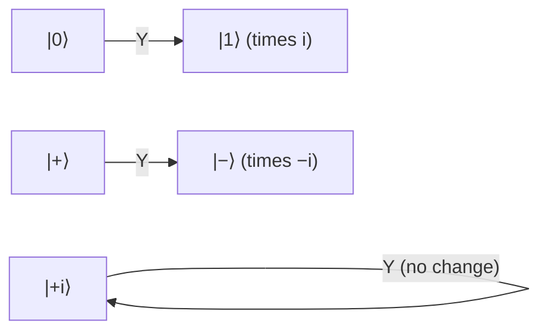

#gate #Y_gate
## What it does
It is a [[quantum gate]]
It's basically an [[X gate|X gate]] But with a [[Phase shift]]
on the [[Bloch sphere]] it's a $180^\circ$ rotation around $y$
(X, Y and Z are the **Pauli** gates, they're the errors in the [[Depolarizing channel]])
## Matrix
$$
\text Y=i
\begin{bmatrix}
0&-1\\
1&0
\end{bmatrix}
$$
## Qiskit implementation
```python
from qiskit import QuantumCircuit

qc = QuantumCircuit(1)
qc.y(0)
```
## Visual representation
![[Y_gate.png]]
## Truth Table
$$
\begin{array}{c|c}
x&\text Y(x)\\ 
\hline
|0\rangle&i|1\rangle\\
|1\rangle&-i|0\rangle
\end{array}
$$
## On the Bloch sphere
![[Y_gate_bloch.png|500]]
flips the sphere around the $y$ axis. $|0\rangle\to|1\rangle$ like an X, but it also flips $|+\rangle\leftrightarrow|-\rangle$ like a Z

$|{+i}\rangle$ and $|{-i}\rangle$ sit on the $y$ axis so they don't move


(what Y does to each state)

## Properties
- $\text Y\text Y=I$ (its own inverse)
- [[Eigenvalues and eigenvectors|eigenvalues]] $+1$ and $-1$ with eigenvectors $|{+i}\rangle$ and $|{-i}\rangle$
- it's a bit flip **and** a phase flip at the same time: $\text Y=i\,\text X\text Z$
> [!note] why the $i$?
> $\text X\text Z=\begin{bmatrix}0&-1\\1&0\end{bmatrix}$ already does "flip + phase", the extra $i$ in front just makes the matrix **Hermitian** (equal to its own conjugate transpose, so it's a proper observable). it's a **global phase**, so on its own you can't measure it (see [[Complex numbers]])
## Where it's used
- as an error it's a **bit + phase flip**, one of the 3 errors in the [[Depolarizing channel]]
- measuring $\sigma_y$ on the Bell state $\frac1{\sqrt2}(|00\rangle+|11\rangle)$ always gives **opposite** answers (see [[CHSH quantum strategy]])

see also [[X gate]], [[Z gate]], [[Depolarizing channel]]
