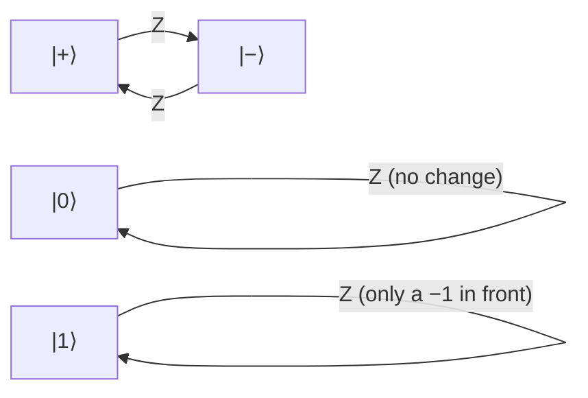

#gate #Z_gate
## What it does 
It is a [[quantum gate]]
Just does a [[Phase shift]] by $\pi$
on the [[Bloch sphere]] it's a $180^\circ$ rotation around $z$
it's the error in the [[Dephasing channel]]
(X, Y and Z are the **Pauli** gates, they're the errors in the [[Depolarizing channel]])
## Matrix
$$
\text Z=
\begin{bmatrix}
1&0
\\
0&-1
\end{bmatrix}
$$
## Qiskit implementation
```python
from qiskit import QuantumCircuit
qc = QuantumCircuit(1)
qc.z(0)
```
## Visual representation
```visual
   ┌───┐
q: ┤ Z ├
   └───┘
```
![[Z_gate.png]]
## Truth Table
$$
\begin{array}{c|c}
x&\text Z(x)\\
\hline
|0\rangle&|0\rangle\\
|1\rangle&-|1\rangle
\end{array}
$$
## On the Bloch sphere
![[Z_gate_bloch.png|500]]
spins the sphere half a turn around the $z$ axis. $|0\rangle$ and $|1\rangle$ are on that axis so they **don't move**, but $|+\rangle\to|-\rangle$ (that's why you only see it in superpositions)


(what Z does to each state)

## Properties
- $\text Z\text Z=I$ (its own inverse)
- [[Eigenvalues and eigenvectors|eigenvalues]] $+1$ and $-1$ with eigenvectors $|0\rangle$ and $|1\rangle$. that's why "measuring $\sigma_z$" means measuring in the $|0\rangle,|1\rangle$ basis
- $\text Z=\text H\,\text X\,\text H$ (a Z is an [[X gate|X]] in the $|+\rangle,|-\rangle$ basis)
## Example
$$
\text Z\big(\alpha|0\rangle+\beta|1\rangle\big)=\alpha|0\rangle-\beta|1\rangle
$$
the probabilities $|\alpha|^2,|\beta|^2$ stay the same, only the **relative phase** changes. eg. $\text Z|+\rangle=|-\rangle$
## Where it's used
- as an error it's a **phase flip**, the error in the [[Dephasing channel]]
- the $\sigma_z$ observable measured in the [[CHSH quantum strategy]] and in [[Rabi oscillation|Rabi oscillations]] ($\langle Z\rangle$)
- the [[CZ gate]] is a controlled Z

see also [[X gate]], [[Y gate]], [[Phase shift]], [[Dephasing channel]]
