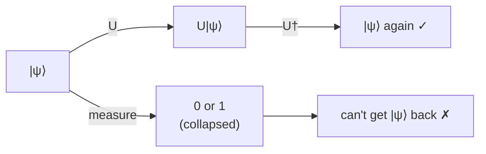

#unitary #matrix #gate
## What it is
A matrix $U$ is **unitary** if
$$
U^\dagger U=UU^\dagger=I
$$
$U^\dagger$ is the conjugate transpose (flip it over the diagonal and change every $i$ to $-i$)
## Why it matters
- every [[Quantum gate|quantum gate]] is a unitary
- it keeps the total probability at 1 (the state stays normalized)
- it can always be undone: the inverse of $U$ is just $U^\dagger$
> [!note] measuring is NOT unitary
> measurement can't be undone, it collapses the state

(unitaries can always be undone, measurement can't)

## Examples
- all the Pauli gates [[X gate|X]], [[Y gate|Y]], [[Z gate|Z]] and the [[Hadamard Gate]]
- any **permutation matrix** (just shuffles the basis states around), eg. the matrices in [[Modular Exponentiation]]
- the [[Quantum Fourier Transform]]
### check with X
$$
\text X^\dagger\text X=\begin{bmatrix}0&1\\1&0\end{bmatrix}\begin{bmatrix}0&1\\1&0\end{bmatrix}=\begin{bmatrix}1&0\\0&1\end{bmatrix}=I
$$

see also [[Quantum gate]], [[Eigenvalues and eigenvectors]], [[Math/Dirac notation]]
