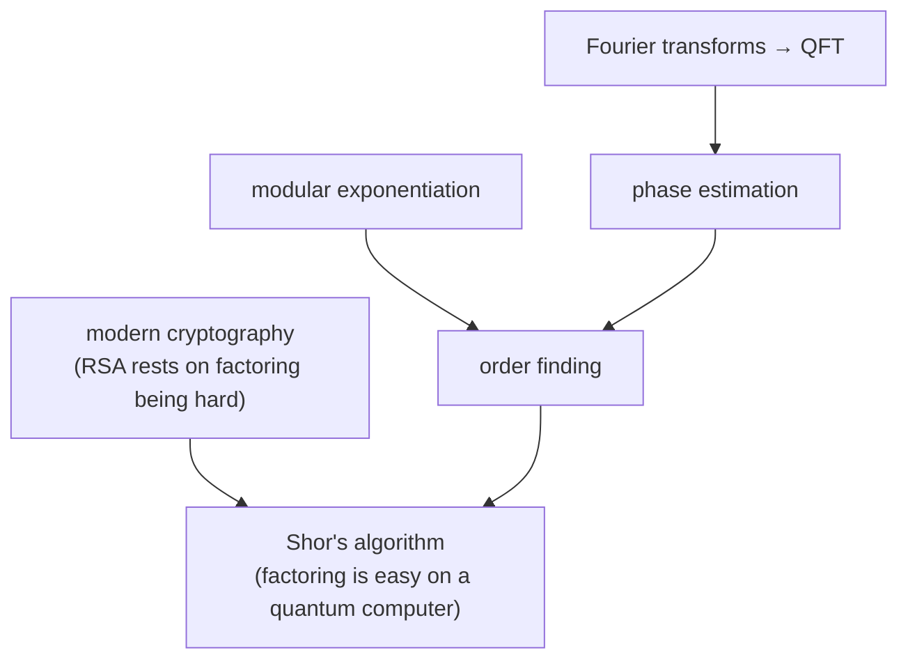

#cryptography #shors_algorithm #quantum_fourier_transform
Course 2, Week 1: **modern cryptography and Shor's algorithm**. how today's internet security works, and how a quantum computer could break it

## cryptography
- [[Modern cryptography]] → symmetric vs public key, Enigma, DES and AES, Diffie–Hellman
- [[RSA]] → how the keys are made, why factoring protects them
## the Fourier toolkit
- [[Fourier Transform]] → splitting a signal into frequencies, repeating signals → spikes
- [[Discrete Fourier Transform]] → the matrix version
- [[Quantum Fourier Transform]] → the same thing on a quantum computer, with exponentially fewer gates
## Shor's algorithm
- [[Modular Exponentiation]] → $a^x\bmod N$ and the "multiply by $a$" gate
- [[Quantum Phase Estimation]] → reading off an eigenvalue's phase
- [[Order finding algorithm]] → the quantum part: finding the period $r$ (with the $N=21$ worked example)
- [[Shor's algorithm]] → the whole thing, factoring 15
- [[Simon's algorithm]] → the algorithm that inspired Shor

next week: [[Quantum cryptography]]
