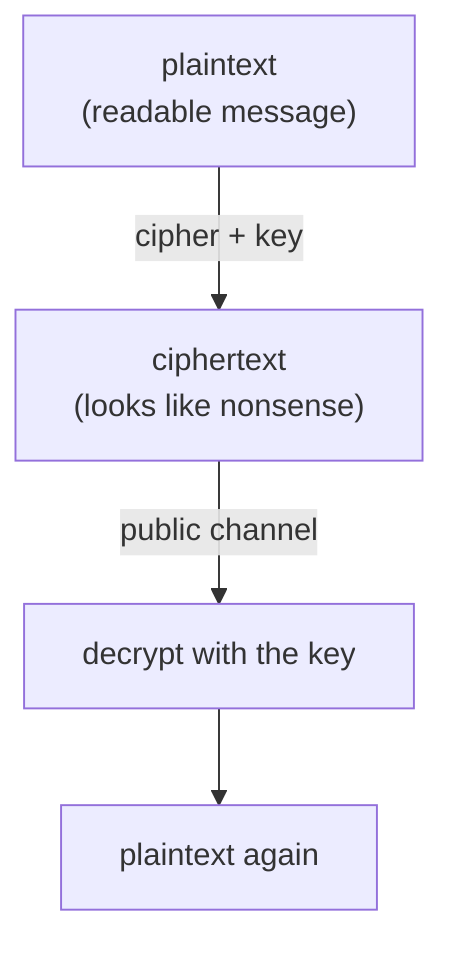
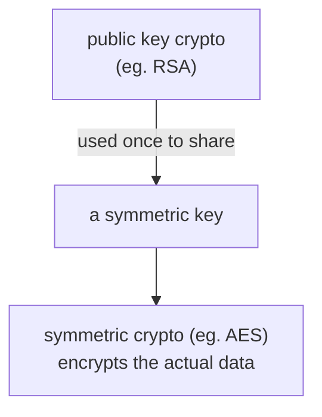

#cryptography #encryption #symmetric_key #public_key
how we keep data secret when it travels over channels anyone can listen to (the internet, wifi...). this is what [[Shor's algorithm]] threatens
## the basic idea

- **cipher** = the algorithm that scrambles plaintext into ciphertext using a **key**
- **decryption** = turning ciphertext back into plaintext (not the other way round)
- the security depends on how much **computing power and time** it would take to find the key without being given it
## the Enigma machine (symmetric)
used by German forces before and during WW2. an electro mechanical **rotor** machine that looks like a typewriter
- each letter gets swapped for a different letter depending on the wiring
- after every letter the **rotor turns**, so the next letter goes through a different electrical path, a different substitution table
- only a machine set up the **same way** can reverse it

in **1941** at **Bletchley Park**, a British team including **Alan Turing** worked out how Enigma worked, which gave the Allies a big advantage in the war
## symmetric keys
**the same key** locks and unlocks (Enigma is one)

| year | standard | what happened |
|---|---|---|
| 1975 | **DES** (IBM) | 56 bit key. by the 2000s, Distributed.Net used 100,000+ computers testing **250 billion keys/second** and found a 56 bit key in about **23 hours** |
| 2001 | **AES** | replaced DES, much bigger keys, still used everywhere today |

> [!question] the problem with symmetric keys
> how do 2 people agree on a secret key **before** they have a secure way to send it?
## public key (asymmetric) cryptography
**1976**: Whitfield **Diffie** and Martin **Hellman** came up with a way to share keys over a public channel (Diffie–Hellman key exchange). this started **public key** cryptography
- **public key** → anyone can use it to **lock** (encrypt) a message
- **private key** → only the owner has it, and it **unlocks** (decrypts)
- the 2 keys are linked by a **one-way function**: easy to compute forwards, practically impossible backwards

**1978**: **Rivest, Shamir and Adleman** published [[RSA]], still the most famous one. (it came out in the late 1990s that the UK's **GCHQ** had secretly invented the same idea in the early 1970s)
## what's actually used: both

public key crypto is used to **set up** the secure channel and hand over a symmetric key, then the fast symmetric key does the real work
> [!note] why not just use public keys for everything?
> they're less efficient. an $n$ bit symmetric key can be **any** of the $2^n$ bit strings, but a public key can only be one of the strings that fit the rules of its one-way function. so public keys have to be **much longer** for the same security (eg. a 128 bit AES key is about as strong as a ~3072 bit RSA key)

## what quantum computers change

| | example | quantum threat |
|---|---|---|
| public key | [[RSA]], Diffie–Hellman | **broken** by [[Shor's algorithm]] (factoring and discrete logs become easy) |
| symmetric key | AES | only weakened: [[Grover's algorithm]] roughly halves the key length, so just use longer keys (AES-256) |

that's why people are moving to [[Post-quantum cryptography]] and looking at [[QKD]] (quantum key distribution, a physics based way to share keys)

see also [[RSA]], [[Shor's algorithm]], [[One-time pad]], [[Post-quantum cryptography]]
