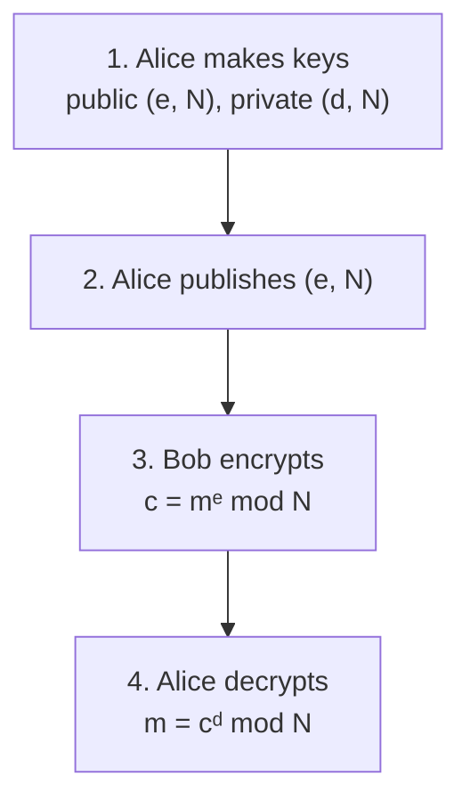

#cryptography #RSA #public_key #modular_arithmetic
the most famous **public key** cryptosystem (Rivest, Shamir, Adleman, 1978). anyone can lock a message for you, only you can unlock it. part of [[Modern cryptography]]
## the 4 steps

## step 1: making the keys
it's all built on [[Modular Exponentiation|modular exponentiation]] $f(x)=a^x\bmod N$, which is **periodic** with some period $r$ (finding it is [[Order finding algorithm|order finding]])

| step | what | example |
|---|---|---|
| 1 | pick 2 random primes $p,q$ | $p=17,\ q=19$ |
| 2 | modulus $N=pq$ | $N=323$ |
| 3 | period $r=(p-1)(q-1)$ ([[Modular arithmetic|Euler's totient]]) | $r=16\times18=288$ |
| 4 | pick a public exponent $e$ with $\gcd(e,r)=1$ | $e=7$ |
| 5 | private exponent $d=e^{-1}\bmod r$ | $d=247$ |

> [!warning] $e^{-1}\bmod r$ is NOT $\frac1e$
> ==it means the whole number $d$ where $d\,e\bmod r=1$.== check: $7\times247=1729=6\times288+1$ ✅
>
> (on a modular calculator you type `A^(-1) mod C`, not `1/A mod C`)

- $e$ has to be between $3$ and $r$ and share no factors with $r$ (that's what $\gcd(e,r)=1$ means)
- $r=(p-1)(q-1)$ is either the real period or a multiple of it (the real one is the lowest common multiple of $p-1$ and $q-1$, here $144$). either works

Alice **publishes** $(e,N)$ and keeps $d$, $p$, $q$ and $r$ **secret**
## steps 3 and 4: locking and unlocking
Bob turns his message into a number $m<N$ and sends
$$
c=m^e\bmod N
$$
Alice unlocks it with
$$
c^d\bmod N=(m^e)^d\bmod N=m
$$
> [!example] with the keys above
> $m=65$ → $c=65^7\bmod323=312$ → $312^{247}\bmod323=65$ ✅ (checked numerically)

> [!example]- why unlocking works
> $d\,e=1+k\,r$ for some whole number $k$, and Euler's theorem says $m^r\equiv1\pmod N$. so
> $$
> m^{ed}=m^{1+kr}=m\cdot(m^r)^k\equiv m\cdot1^k=m\pmod N
> $$

## why Eve can't read it
Eve sees $(e,N)$ and $c$. to get $d$ she needs $r$, and to get $r$ she needs $p$ and $q$, which means **factoring $N$**

multiplying $p\times q$ is instant, but going backwards is practically impossible for big $N$ (real keys use 2048+ bit numbers) on a normal computer. that's the **one-way function**
> [!danger] where quantum computers come in
> [[Shor's algorithm]] finds the period $r$ (and so factors $N$) **efficiently**. a big enough quantum computer breaks RSA, which is why [[Post-quantum cryptography]] exists

> [!example]- bonus: you can multiply encrypted numbers
> from a slide in Course 3: RSA has a neat property
> $$
> \text{Enc}(a)\cdot\text{Enc}(b)=a^e\,b^e=(ab)^e=\text{Enc}(ab)\pmod N
> $$
> so someone can **multiply** 2 encrypted numbers without ever decrypting them. eg. with the keys above: $\text{Enc}(5)=282$, $\text{Enc}(7)=216$, and $282\times216\bmod323=188=\text{Enc}(35)$, which decrypts to $35=5\times7$ ✅ (checked numerically)
>
> the course used this for an **encrypted controller**: a computer that controls a machine (the "plant") while only ever seeing encrypted numbers. it's an example of **homomorphic encryption**

## practice (from the course)
$p=101,\ q=113$
- $N=11413$
- $r=100\times112=11200$
- $11200=2^6\times5^2\times7$, so $e$ can't be divisible by 2, 5 or 7. the valid ones start $3,\ 9,\ 11,\ 13,\ldots$ so the 4th smallest is $13$
- with $e=3533$ the private exponent is $d=6597$

(all checked numerically)

see also [[Modern cryptography]], [[Shor's algorithm]], [[Modular arithmetic]], [[Order finding algorithm]]
