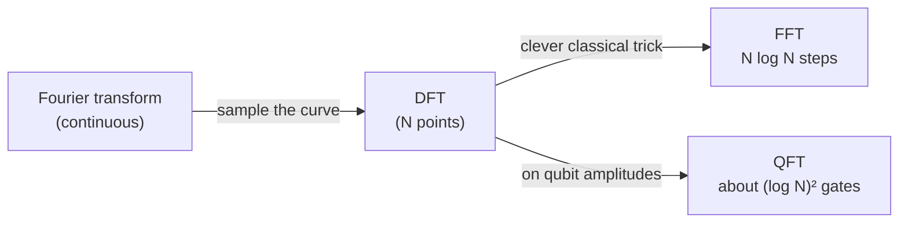

#fourier_transform
## What it is
It's basically the same thing as the [[Fourier Transform]] but instead of a continuous curve it's just a bunch of points and instead of doing integration we do summation  
## How it works
$X_k = \sum_{n=0}^{N-1} x_n \, e^{-i 2\pi \frac{k}{N} n}$ 
Finds area through summation instead of integration
==as this is a LINEAR TRANSFORMATION this can be represented with a MATRIX==
## MATRIX
$$
F_N =
\frac{1}{\sqrt{N}}
\begin{bmatrix}
1 & 1 & 1 & \cdots & 1 \\
1 & \omega & \omega^2 & \cdots & \omega^{N-1} \\
1 & \omega^2 & \omega^4 & \cdots & \omega^{2(N-1)} \\
\vdots & \vdots & \vdots & \ddots & \vdots \\
1 & \omega^{N-1} & \omega^{2(N-1)} & \cdots & \omega^{(N-1)(N-1)}
\end{bmatrix}
$$
^matrix

$$
\omega=e^{-\frac{2\pi i}{N}}
$$
> [!note] sign convention
> for the formula above $\omega=e^{-2\pi i/N}$ (minus sign). the [[Quantum Fourier Transform]] uses $\omega=e^{+2\pi i/N}$ (plus sign), so it's really the same matrix with the opposite sign in the exponent (the inverse DFT)
>
> the $\frac1{\sqrt N}$ in front makes the matrix [[Unitary Operation|unitary]], the formula above just leaves it out
## Worked example ($N=4$)
with $N=4$, $\omega=e^{-2\pi i/4}=-i$ so the powers just go $1,-i,-1,i$
$$
F_4=\frac12\begin{bmatrix}1&1&1&1\\1&-i&-1&i\\1&-1&1&-1\\1&i&-1&-i\end{bmatrix}
$$
using the formula (without the $\frac1{\sqrt N}$)

| signal $x_n$ | DFT $X_k$ | what it means |
|---|---|---|
| $1,0,0,0$ | $1,1,1,1$ | one sharp spike in time → **every** frequency equally |
| $1,1,1,1$ | $4,0,0,0$ | flat (never changes) → only frequency 0 |
| $1,0,-1,0$ | $0,2,0,2$ | a cosine that repeats every 4 → frequency 1 (and its mirror, 3) |

> [!tip] check one yourself
> for $x=(1,0,-1,0)$: $X_k=1\cdot\omega^0+(-1)\cdot\omega^{2k}=1-(-1)^k$, which is $0,2,0,2$ ✅
## Periods show up as spikes
![[DFT_example.png]]

a signal with $N=8$ points that's 1 every **4th** point ($r=4$) has its DFT spikes at $k=0,2,4,6$, the multiples of $\frac Nr=2$. find the spacing of the spikes and you've found the period
$$
r=\frac{N}{\text{spacing}}=\frac82=4
$$
this is exactly what happens inside [[Shor's algorithm]]

(how the Fourier transforms are related)

## How fast is it?

| | steps |
|---|---|
| DFT straight from the formula | $N^2$ |
| FFT (fast Fourier transform, the clever classical way) | $N\log_2N$ |
| [[Quantum Fourier Transform]] on $n$ qubits ($N=2^n$) | about $n^2=(\log_2N)^2$ gates |

the QFT is **way** faster, but the catch is you can't read out all $N$ answers, you only get to measure one outcome (see [[Quantum Fourier Transform#Limits of the Quantum Fourier Transform]])

see also [[Fourier Transform]]
