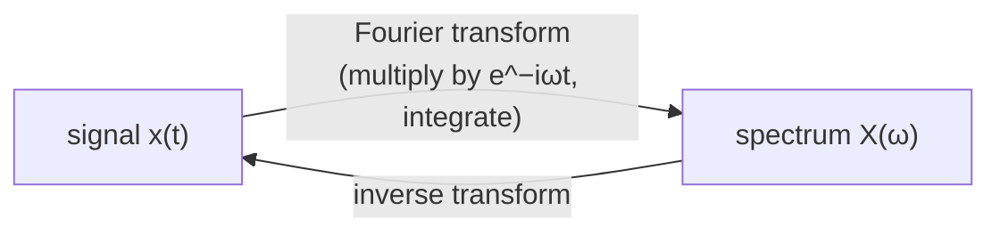

#fourier_transform
continuous version of [[Discrete Fourier Transform]]
## What it does
It takes a continuous curve (eg $f\left(x\right)=\sin\left(x\right)+\cos\left(4x\right)+2\cos\left(6x\right)+10\sin\left(2x\right)+4\sin\left(3x\right)+\sin\left(4x\right)+\sin\left(5x\right)$ )
and converts it into the frequency and amplitude.

## How it works
the trick is that waves with different frequencies cancel out when you multiply them and integrate
$$
\int_0^{2\pi}\sin (x)\sin(x)\,dx=\pi\qquad\int_0^{2\pi}\sin(x)\sin(2x)\,dx=0
$$
so if you multiply the curve by a wave of one frequency and integrate, only the part of the curve with **that same frequency** survives, and how big the answer is tells you its amplitude

do that for every frequency and you get the whole spectrum
$$
X(\omega) = \int_{-\infty}^{\infty} x(t)\, e^{-i \omega t}\, dt
$$
## Example
the curve from above, and what the Fourier transform finds hiding in it

![[Fourier_example.png]]

| frequency | 1 | 2 | 3 | 4 | 5 | 6 |
|---|---|---|---|---|---|---|
| amplitude | 1 | 10 | 4 | $\sqrt2\approx1.41$ | 1 | 2 |

(frequency 4 has both $\cos(4x)$ and $\sin(4x)$, which add up to one wave of size $\sqrt{1^2+1^2}=\sqrt2$)
## Why $e^{-i\omega t}$?
it's a sine and a cosine in one (see [[Complex numbers]])
$$
e^{-i\omega t}=\cos(\omega t)-i\sin(\omega t)
$$
so one formula checks for **both** the sine part and the cosine part of each frequency at the same time
## Going back
the **inverse** Fourier transform rebuilds the curve from its frequencies, nothing is lost
$$
x(t)=\frac1{2\pi}\int_{-\infty}^{\infty}X(\omega)\,e^{i\omega t}\,d\omega
$$

## Why it matters for quantum
> [!important] repeating signals → sharp spikes
> ==if a signal **repeats** every $r$ steps, its Fourier transform only has spikes at multiples of $\frac1r$.== so the Fourier transform is a way to **find the period** of something
>
> that's the whole trick behind [[Shor's algorithm]]: it makes a signal that repeats with period $r$ and uses the [[Quantum Fourier Transform]] to find $r$

see also [[Discrete Fourier Transform]], [[Quantum Fourier Transform]]
