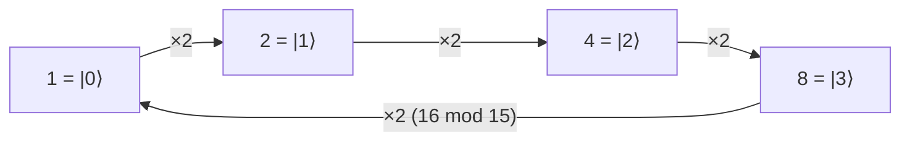

#modular_exponentiation #shors_algorithm
It is just a [[Unitary Operation]]
# Making the matrix
## Modular Exponentiation in Shor’s Algorithm (IBM Demo Case)

In practical demonstrations of [[Shor's algorithm|Shor’s algorithm]] (such as IBM’s), the modular exponentiation circuit is simplified.
The goal is still
$$
|x\rangle|1\rangle \mapsto |x\rangle|a^x \bmod N\rangle
$$
but instead of building a general circuit for this, the demo only uses the few values the second register can actually reach, so it needs the smallest number of qubits possible.

This note describes the explicit matrix used for the case $N=15$ and $a=2$.

## Chosen Parameters

We choose
$$
N = 15,\qquad a = 2
$$
These satisfy the requirement $\gcd(a,N)=1$.

## Modular Exponentiation Function

The function used is
$$
f(x) = 2^x \bmod 15
$$
Evaluating this gives
$$
2^x \bmod 15 = 1,\ 2,\ 4,\ 8,\ 1,\dots
$$
The function is periodic with period $r=4$.

## Reduced Register Choice

Starting from $1$ and multiplying by $2$ only ever gives $1,2,4,8$, so the second register only needs $2$ qubits after relabeling:
$$
1\to|0\rangle,\quad 2\to|1\rangle,\quad 4\to|2\rangle,\quad 8\to|3\rangle
$$

## Action of the Gate

The basic gate is **multiply by 2**
$$
U\,|y\rangle = |2y \bmod 15\rangle
$$
Explicitly (with the real values)
$$
\begin{aligned}
1 &\mapsto 2 \\
2 &\mapsto 4 \\
4 &\mapsto 8 \\
8 &\mapsto 1
\end{aligned}
$$
Doing it $x$ times gives $2^x$
$$
U^x\,|1\rangle = |2^x \bmod 15\rangle
$$
In the circuit, each qubit $x_j$ of the first register controls $U^{2^j}$, so together they apply $U^x$.

(the multiply by 2 gate goes round in a loop)

## Actual Matrix Representation

In the relabeled basis $|0\rangle,|1\rangle,|2\rangle,|3\rangle$ the gate is the matrix
$$
U
=
\begin{pmatrix}
0 & 0 & 0 & 1 \\
1 & 0 & 0 & 0 \\
0 & 1 & 0 & 0 \\
0 & 0 & 1 & 0
\end{pmatrix}
$$

## Interpretation

- Each column is an input and the row with the 1 is the output
- It just shifts $|0\rangle\to|1\rangle\to|2\rangle\to|3\rangle\to|0\rangle$, which is $1\to2\to4\to8\to1$
- The matrix is a permutation matrix, so it is unitary
- It's the $M_2$ matrix below, shrunk down to only the 4 values that matter
- This is exactly the form used in small-scale IBM Shor demonstrations

## Important Note

This matrix is not the full scalable modular exponentiation operator.
It is a compiled, problem-specific unitary used to demonstrate [[Order finding algorithm|order finding]] on near-term quantum hardware.

# IBM Demo splitting
## Modular Multiplication Matrices in Shor’s Algorithm
### N = 15, a = 2 (Fully Explicit, Color-Coded)

We work in the computational basis
$$
|0\rangle, |1\rangle, |2\rangle, \dots, |14\rangle
$$

All matrices below are $15\times15$ permutation matrices.

## Definition

For any $k$, define
$$
M_k |y\rangle = |k y \bmod 15\rangle
$$

## The Operator M₂ (colored BLUE)

### Relation
$$
y \mapsto 2y \bmod 15
$$

$$
\begin{aligned}
0&\to0,&1&\to2,&2&\to4,&3&\to6,&4&\to8,\\
5&\to10,&6&\to12,&7&\to14,&8&\to1,&9&\to3,\\
10&\to5,&11&\to7,&12&\to9,&13&\to11,&14&\to13
\end{aligned}
$$

### Matrix
$$
\color{blue}{
M_2 =
\begin{pmatrix}
\boxed{\mathbf{1}}&0&0&0&0&0&0&0&0&0&0&0&0&0&0\\
0&0&0&0&0&0&0&0&\boxed{\mathbf{1}}&0&0&0&0&0&0\\
0&\boxed{\mathbf{1}}&0&0&0&0&0&0&0&0&0&0&0&0&0\\
0&0&0&0&0&0&0&0&0&\boxed{\mathbf{1}}&0&0&0&0&0\\
0&0&\boxed{\mathbf{1}}&0&0&0&0&0&0&0&0&0&0&0&0\\
0&0&0&0&0&0&0&0&0&0&\boxed{\mathbf{1}}&0&0&0&0\\
0&0&0&\boxed{\mathbf{1}}&0&0&0&0&0&0&0&0&0&0&0\\
0&0&0&0&0&0&0&0&0&0&0&\boxed{\mathbf{1}}&0&0&0\\
0&0&0&0&\boxed{\mathbf{1}}&0&0&0&0&0&0&0&0&0&0\\
0&0&0&0&0&0&0&0&0&0&0&0&\boxed{\mathbf{1}}&0&0\\
0&0&0&0&0&\boxed{\mathbf{1}}&0&0&0&0&0&0&0&0&0\\
0&0&0&0&0&0&0&0&0&0&0&0&0&\boxed{\mathbf{1}}&0\\
0&0&0&0&0&0&\boxed{\mathbf{1}}&0&0&0&0&0&0&0&0\\
0&0&0&0&0&0&0&0&0&0&0&0&0&0&\boxed{\mathbf{1}}\\
0&0&0&0&0&0&0&\boxed{\mathbf{1}}&0&0&0&0&0&0&0
\end{pmatrix}
}
$$

## The Operator M₄ = M₂² (colored CYAN)

### Relation
$$
y \mapsto 4y \bmod 15
$$

$$
\begin{aligned}
0&\to0,&1&\to4,&2&\to8,&3&\to12,&4&\to1,\\
5&\to5,&6&\to9,&7&\to13,&8&\to2,&9&\to6,\\
10&\to10,&11&\to14,&12&\to3,&13&\to7,&14&\to11
\end{aligned}
$$

### Matrix
$$
\color{cyan}{
M_4 =
\begin{pmatrix}
\boxed{\mathbf{1}}&0&0&0&0&0&0&0&0&0&0&0&0&0&0\\
0&0&0&0&\boxed{\mathbf{1}}&0&0&0&0&0&0&0&0&0&0\\
0&0&0&0&0&0&0&0&\boxed{\mathbf{1}}&0&0&0&0&0&0\\
0&0&0&0&0&0&0&0&0&0&0&0&\boxed{\mathbf{1}}&0&0\\
0&\boxed{\mathbf{1}}&0&0&0&0&0&0&0&0&0&0&0&0&0\\
0&0&0&0&0&\boxed{\mathbf{1}}&0&0&0&0&0&0&0&0&0\\
0&0&0&0&0&0&0&0&0&\boxed{\mathbf{1}}&0&0&0&0&0\\
0&0&0&0&0&0&0&0&0&0&0&0&0&\boxed{\mathbf{1}}&0\\
0&0&\boxed{\mathbf{1}}&0&0&0&0&0&0&0&0&0&0&0&0\\
0&0&0&0&0&0&\boxed{\mathbf{1}}&0&0&0&0&0&0&0&0\\
0&0&0&0&0&0&0&0&0&0&\boxed{\mathbf{1}}&0&0&0&0\\
0&0&0&0&0&0&0&0&0&0&0&0&0&0&\boxed{\mathbf{1}}\\
0&0&0&\boxed{\mathbf{1}}&0&0&0&0&0&0&0&0&0&0&0\\
0&0&0&0&0&0&0&\boxed{\mathbf{1}}&0&0&0&0&0&0&0\\
0&0&0&0&0&0&0&0&0&0&0&\boxed{\mathbf{1}}&0&0&0
\end{pmatrix}
}
$$

## The Operator M₈ = M₂³ (colored PURPLE)

### Relation
$$
y \mapsto 8y \bmod 15
$$

$$
\begin{aligned}
0&\to0,&1&\to8,&2&\to1,&3&\to9,&4&\to2,\\
5&\to10,&6&\to3,&7&\to11,&8&\to4,&9&\to12,\\
10&\to5,&11&\to13,&12&\to6,&13&\to14,&14&\to7
\end{aligned}
$$

### Matrix
$$
\color{purple}{
M_8 =
\begin{pmatrix}
\boxed{\mathbf{1}}&0&0&0&0&0&0&0&0&0&0&0&0&0&0\\
0&0&\boxed{\mathbf{1}}&0&0&0&0&0&0&0&0&0&0&0&0\\
0&0&0&0&\boxed{\mathbf{1}}&0&0&0&0&0&0&0&0&0&0\\
0&0&0&0&0&0&\boxed{\mathbf{1}}&0&0&0&0&0&0&0&0\\
0&0&0&0&0&0&0&0&\boxed{\mathbf{1}}&0&0&0&0&0&0\\
0&0&0&0&0&0&0&0&0&0&\boxed{\mathbf{1}}&0&0&0&0\\
0&0&0&0&0&0&0&0&0&0&0&0&\boxed{\mathbf{1}}&0&0\\
0&0&0&0&0&0&0&0&0&0&0&0&0&0&\boxed{\mathbf{1}}\\
0&\boxed{\mathbf{1}}&0&0&0&0&0&0&0&0&0&0&0&0&0\\
0&0&0&\boxed{\mathbf{1}}&0&0&0&0&0&0&0&0&0&0&0\\
0&0&0&0&0&\boxed{\mathbf{1}}&0&0&0&0&0&0&0&0&0\\
0&0&0&0&0&0&0&\boxed{\mathbf{1}}&0&0&0&0&0&0&0\\
0&0&0&0&0&0&0&0&0&\boxed{\mathbf{1}}&0&0&0&0&0\\
0&0&0&0&0&0&0&0&0&0&0&\boxed{\mathbf{1}}&0&0&0\\
0&0&0&0&0&0&0&0&0&0&0&0&0&\boxed{\mathbf{1}}&0
\end{pmatrix}
}
$$

## Full 60×60 Modular Exponentiation Matrix (Block-Colored)

The full unitary
$$
U_{2,15}\,|x\rangle|y\rangle = |x\rangle\,|2^x y \bmod 15\rangle
$$
has block structure

$$
U_{2,15}
=
\begin{pmatrix}
\color{red}{I} & 0 & 0 & 0 \\
0 & \color{blue}{M_2} & 0 & 0 \\
0 & 0 & \color{cyan}{M_4} & 0 \\
0 & 0 & 0 & \color{purple}{M_8}
\end{pmatrix}
$$

Each block is $15\times15$, so the full matrix is $60\times60$.

