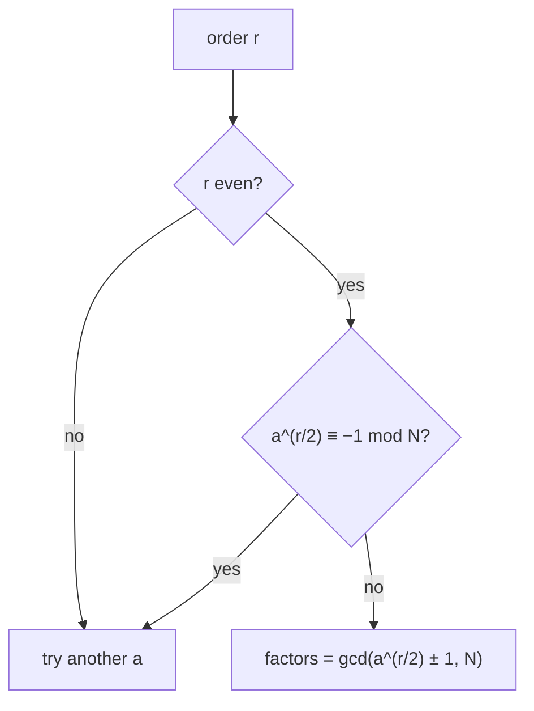

#order_finding #shors_algorithm
the problem at the heart of [[Shor's algorithm]]
## the problem
given $a$ and $N$, find the **order** $r$: the smallest number where
$$
a^r \equiv 1 \pmod N
$$
eg. $a=2,\ N=15$: $2^1=2,\ 2^2=4,\ 2^3=8,\ 2^4=16\equiv1$ so $r=4$ (see [[Modular Exponentiation]])
## classical vs quantum
- classically this is really slow for big $N$
- a quantum computer can do it fast using [[Modular Exponentiation]] + the [[Quantum Fourier Transform]] (together this is [[Quantum Phase Estimation]]). that quantum part is what makes [[Shor's algorithm]] fast
## why the order lets you factor
if $r$ is **even**, then $a^r-1\equiv0\pmod N$ can be split up
$$
a^r-1=(a^{r/2}-1)(a^{r/2}+1)\equiv0\pmod N
$$
so $N$ divides the product, which means $N$ shares a factor with $a^{r/2}-1$ or $a^{r/2}+1$. [[Modular arithmetic#gcd|gcd]] finds it

eg. $a=2,\ N=15,\ r=4$: $a^{r/2}=4$
$$
\gcd(4-1,15)=3\qquad\gcd(4+1,15)=5\qquad3\times5=15\ ✅
$$
> [!warning] when it doesn't work
> - $r$ is **odd** → can't split it in half
> - $a^{r/2}\equiv-1\pmod N$ → the gcd just gives $1$ or $N$
>
> then just pick a different $a$ and try again. at least half of all $a$ values work, so it doesn't take many tries

(from the order to the factors)

## how the quantum part finds $r$
1. make the gate $U|y\rangle=|a\,y\bmod N\rangle$ (multiply by $a$, see [[Modular Exponentiation]])
2. its [[Eigenvalues and eigenvectors|eigenvalues]] are $e^{2\pi i\,s/r}$ for $s=0,1,\ldots,r-1$, so $r$ is hiding in the **phase**
3. [[Quantum Phase Estimation]] measures a phase $\approx\frac sr$ for a random $s$
4. turn the measured number into a fraction to read off $r$

eg. with 8 counting qubits and $N=15,\ a=2$ you measure $0$, $64$, $128$ or $192$ (out of $256$)
- $\frac{64}{256}=\frac14$ → $r=4$ ✅
- $\frac{192}{256}=\frac34$ → $r=4$ ✅
- $\frac{128}{256}=\frac12$ → looks like $r=2$, but $2^2=4\not\equiv1$, so run again
- $0$ → tells you nothing, run again

see [[Shor's algorithm#Worked example (factoring 15)]] for the full thing
## worked example 2 (11 to the x, mod 21)
the course's example: find the period of $f(x)=11^x\bmod21$
$$
11^0,11^1,11^2,\ldots\bmod21=1,\ 11,\ 16,\ 8,\ 4,\ 2,\ 1,\ 11,\ldots
$$
so the answer should be $r=6$. here's how the quantum version finds it

**how many qubits?** the first register needs $N^2\le2^l\le2N^2$, so $441\le2^l\le882$ → $l=9$ qubits ($2^9=512$). enough room to catch the period clearly
1. Hadamards → $\frac1{\sqrt{512}}\sum_{x=0}^{511}|x\rangle|0\rangle$
2. modular exponentiation → $\frac1{\sqrt{512}}\sum_x|x\rangle|11^x\bmod21\rangle$
3. measure the 2nd register, say you get $16$. that only happens for $x=2,8,14,\ldots$ (every 6th), so the first register is left holding $|2\rangle+|8\rangle+|14\rangle+\ldots$
4. QFT on the first register → spikes near multiples of $\frac{512}6\approx85.3$
5. measure, say you get $427$

![[Period_finding_21.png]]
(my simulation of step 5: 6 spikes, you land on one at random)

**6. continued fractions** turn $\frac{427}{512}$ into a fraction with a small bottom
$$
\frac{427}{512}=0+\cfrac1{1+\cfrac1{5+\cfrac1{42+\cfrac12}}}
$$
cutting it off at each step gives the **convergents** $\frac01,\ \frac11,\ \frac56,\ \frac{211}{253}$ (using $z_n=a_nz_{n-1}+z_{n-2}$ and $r_n=a_nr_{n-1}+r_{n-2}$)

try the bottoms as guesses for $r$: $11^6\bmod21=1$ ✅ so $r=6$
> [!example]- and then factoring 21
> $r=6$ is even and $11^3\bmod21=8\not\equiv-1$, so
> $$
> \gcd(8-1,21)=7\qquad\gcd(8+1,21)=3\qquad21=3\times7\ ✅
> $$
> (all checked numerically)

see also [[Shor's algorithm]], [[Quantum Phase Estimation]], [[Modular arithmetic]]
