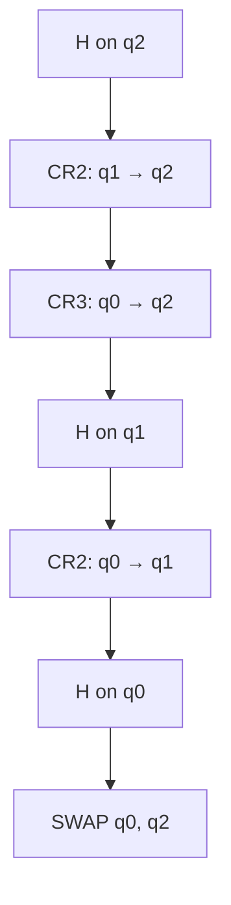

#quantum_fourier_transform #fourier_transform
The Quantum Fourier Transform is a [[Unitary Operation]] (the same matrix as the one in [[Discrete Fourier Transform]])
![[Discrete Fourier Transform#^matrix]]

It is a vital step in [[Shor's algorithm]]
## Example
### 3 qubits
![[3_Qubit_QFT.png]] 
#### Matrix 
$$
\mathrm{QFT}_8
=
\frac{1}{\sqrt{8}}
\begin{bmatrix}
1 & 1 & 1 & 1 & 1 & 1 & 1 & 1 \\
1 & \omega & \omega^2 & \omega^3 & \omega^4 & \omega^5 & \omega^6 & \omega^7 \\
1 & \omega^2 & \omega^4 & \omega^6 & 1 & \omega^2 & \omega^4 & \omega^6 \\
1 & \omega^3 & \omega^6 & \omega & \omega^4 & \omega^7 & \omega^2 & \omega^5 \\
1 & \omega^4 & 1 & \omega^4 & 1 & \omega^4 & 1 & \omega^4 \\
1 & \omega^5 & \omega^2 & \omega^7 & \omega^4 & \omega & \omega^6 & \omega^3 \\
1 & \omega^6 & \omega^4 & \omega^2 & 1 & \omega^6 & \omega^4 & \omega^2 \\
1 & \omega^7 & \omega^6 & \omega^5 & \omega^4 & \omega^3 & \omega^2 & \omega
\end{bmatrix}
$$
$$
\omega=e^{\frac {2\pi i}{8}}
$$
#### Summation
##### Notation
$$
\mathrm{QFT}_8 \lvert x \rangle
=
\frac{1}{\sqrt{8}}
\sum_{k=0}^{7}
e^{2\pi i \frac{xk}{8}}
\lvert k \rangle
$$
##### Series
$$
\mathrm{QFT}_8 \lvert x \rangle
=
\frac{1}{\sqrt{8}}
\Big(
\lvert 0\rangle
+ e^{2\pi i \frac{x}{8}} \lvert 1\rangle
+ e^{2\pi i \frac{2x}{8}} \lvert 2\rangle
+ e^{2\pi i \frac{3x}{8}} \lvert 3\rangle
+ e^{2\pi i \frac{4x}{8}} \lvert 4\rangle
+ e^{2\pi i \frac{5x}{8}} \lvert 5\rangle
+ e^{2\pi i \frac{6x}{8}} \lvert 6\rangle
+ e^{2\pi i \frac{7x}{8}} \lvert 7\rangle
\Big)
$$
## Convert the matrix into Quantum gates
### Quantum Fourier Transform → Quantum Gates

The Quantum Fourier Transform (QFT) is defined as a unitary matrix, but quantum
hardware can only implement small [[Quantum gate|quantum gates]]. The goal is to express the QFT
matrix as a sequence of elementary gates.

### QFT Definition

$$
N = 2^n
$$

$$
\mathrm{QFT}\,|x\rangle
=
\frac{1}{\sqrt{N}}
\sum_{k=0}^{N-1}
e^{2\pi i xk / N}
|k\rangle
$$

### Binary Representation of the Input State

$$
|x\rangle
=
|x_{n-1} x_{n-2} \cdots x_0\rangle,
\quad
x_j \in \{0,1\}
$$

$$
\mathrm{QFT}\,|x\rangle
=
\frac{1}{2^{n/2}}
\bigotimes_{j=0}^{n-1}
\left(
|0\rangle
+
e^{2\pi i (0.x_j x_{j-1} \cdots x_0)}
|1\rangle
\right)
$$

### Elementary Gates Used

#### Hadamard Gate

$$
H
=
\frac{1}{\sqrt{2}}
\begin{bmatrix}
1 & 1 \\
1 & -1
\end{bmatrix}
$$

#### Phase Rotation Gate

$$
R_k
=
\begin{bmatrix}
1 & 0 \\
0 & e^{2\pi i / 2^k}
\end{bmatrix}
$$

### QFT Gate Decomposition Algorithm

For qubits indexed from most significant to least significant:

1. Apply a [[Hadamard Gate|Hadamard gate]] to qubit $i$
2. For each qubit $j > i$, apply a controlled-$R_{j-i+1}$ gate (a controlled [[Phase shift]])
3. Reverse the qubit order using [[SWAP gate|SWAP gates]]

### Three-Qubit QFT Example

Input state:

$$
|q_2 q_1 q_0\rangle
$$

Gate sequence:

$$
H(q_2)
\rightarrow
\mathrm{CR}_2(q_1 \rightarrow q_2)
\rightarrow
\mathrm{CR}_3(q_0 \rightarrow q_2)
$$

$$
H(q_1)
\rightarrow
\mathrm{CR}_2(q_0 \rightarrow q_1)
$$

$$
H(q_0)
$$

$$
\mathrm{SWAP}(q_2,q_0)
$$

### Matrix Interpretation

Each gate corresponds to a unitary matrix. The full QFT unitary is the ordered
product of all gate matrices:

$$
U_{\mathrm{QFT}}
=
\prod_{k=1}^{m} G_k
$$

(the 3 qubit gate sequence)

### Complexity

$$
\text{Gate count} = O(n^2)
$$

## Limits of the Quantum Fourier Transform

Unlike the classical Discrete Fourier Transform, the Quantum Fourier Transform
does not act on a continuous signal or a sampled time series.
Its limits arise purely from the **finite dimension of the Hilbert space**.

---

## Source of the Limit

For an $n$-qubit register,
$$
N = 2^n
$$

The QFT acts on the cyclic group
$$
\mathbb{Z}_{2^n}
$$

This immediately implies a **hard upper bound** on how many distinct “frequencies”
(or phase indices) can exist.

---

## Number of Distinguishable Frequencies

The QFT produces exactly
$$
\boxed{2^n}
$$
distinct frequency components, indexed by
$$
k = 0,1,2,\dots,2^n - 1
$$

There are:
- No additional hidden frequencies
- No continuous spectrum
- No fractional indices without increasing $n$

---

## Phase Resolution

If a state carries an [[Eigenvalues and eigenvectors|eigenphase]]
$$
e^{2\pi i \theta}
$$
the QFT resolves it as
$$
\theta \approx \frac{k}{2^n}
$$

The smallest resolvable phase difference is therefore
$$
\boxed{\Delta \theta = \frac{1}{2^n}}
$$

Adding one qubit **doubles the phase resolution**.

---

## No Nyquist Limit

The QFT has **no Nyquist frequency**, because:

- There is no sampling process
- There is no time axis
- The domain is already discrete

Instead of aliasing, the QFT exhibits **[[Modular arithmetic|modular wraparound]]**:
$$
k \equiv k + 2^n
$$

All frequencies are defined modulo $2^n$.

---

## Interpretation

- The QFT is a change of basis on a finite-dimensional space
- Its limits are set entirely by the number of qubits
- Increasing $n$ increases both:
  - the number of frequency bins
  - the precision of phase estimation

This limit directly controls the accuracy of [[Quantum Phase Estimation]] and,
by extension, the success probability of [[Shor's algorithm]].

---

## Final Insight

The QFT does not extract arbitrary frequencies.
It resolves phase information on a **finite cyclic grid** whose size is fixed by
the number of qubits:

$$
\boxed{\text{QFT limit} = 2^n \text{ discrete, modular frequencies}}
$$

see also [[Discrete Fourier Transform]], [[Quantum Phase Estimation]], [[Shor's algorithm]], [[HHL algorithm]]
