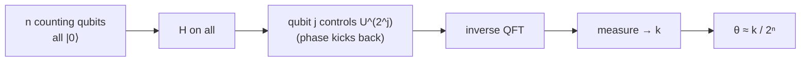

#quantum_phase_estimation #shors_algorithm
## What it does
if you have a [[Unitary Operation]] $U$ and one of its [[Eigenvalues and eigenvectors|eigenstates]] $|u\rangle$
$$
U|u\rangle=e^{2\pi i\theta}|u\rangle
$$
QPE finds the phase $\theta$
## How it works
2 registers: $n$ counting qubits (all start $|0\rangle$) and the eigenstate $|u\rangle$
1. [[Hadamard Gate|Hadamard]] on every counting qubit
2. counting qubit $j$ controls $U^{2^j}$ on the second register (this kicks the phase back onto the counting qubits)
3. inverse [[Quantum Fourier Transform]] on the counting qubits
4. measure the counting qubits → you get a number $k$

$$
\theta\approx\frac{k}{2^n}
$$
more counting qubits = more precise $\theta$ (see [[Quantum Fourier Transform#Phase Resolution]])

## Why it matters
[[Shor's algorithm]] is basically QPE: the [[Order finding algorithm|order finding]] part runs QPE on $U|y\rangle=|ay \bmod N\rangle$ (the [[Modular Exponentiation]] gate). its phases are $\theta=\frac sr$, so measuring $\theta$ lets you find the order $r$
