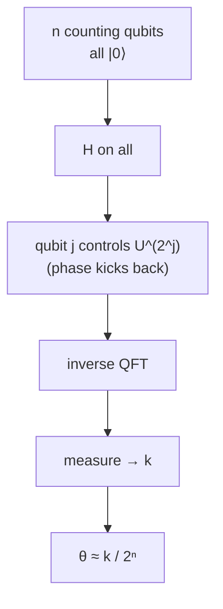

#quantum_phase_estimation #shors_algorithm
## What it does
if you have a [[Unitary Operation]] $U$ and one of its [[Eigenvalues and eigenvectors|eigenstates]] $|u\rangle$
$$
U|u\rangle=e^{2\pi i\theta}|u\rangle
$$
QPE finds the phase $\theta$
## How it works
2 registers: $n$ counting qubits (all start $|0\rangle$) and the eigenstate $|u\rangle$
1. [[Hadamard Gate|Hadamard]] on every counting qubit
2. counting qubit $j$ controls $U^{2^j}$ on the second register (this kicks the phase back onto the counting qubits)
3. inverse [[Quantum Fourier Transform]] on the counting qubits
4. measure the counting qubits → you get a number $k$

$$
\theta\approx\frac{k}{2^n}
$$
more counting qubits = more precise $\theta$ (see [[Quantum Fourier Transform#Phase Resolution]])

## Why it matters
[[Shor's algorithm]] is basically QPE: the [[Order finding algorithm|order finding]] part runs QPE on $U|y\rangle=|ay \bmod N\rangle$ (the [[Modular Exponentiation]] gate). its phases are $\theta=\frac sr$, so measuring $\theta$ lets you find the order $r$

## finding energies (Course 2 Week 3)
the other big use: finding the **energies** of a molecule or material ([[Simulating quantum systems]])
- use $U=e^{-iHt}$ (built with [[Trotterization]]). its eigenstates are the energy states of $H$, with eigenvalues $e^{-iE_kt}$
- so the phase QPE measures is $\theta=-\frac{E_kt}{2\pi}$ (mod 1), which gives the **energy** $E_k$
- you usually don't have the ground state ready, so start with a **guess** state. QPE then lands on the ground state with probability $|\langle\text{guess}|E_0\rangle|^2$, so a good guess (like the classical Hartree–Fock one) matters
> [!warning] precise, but not exact
> $n$ counting qubits give the phase to about $\frac1{2^n}$ (it keeps the first $n$ binary digits of $\theta$). QPE finds an **estimate**, not the exact phase. more accuracy = more qubits and **longer** controlled $U^{2^j}$ circuits, which is why on today's noisy machines people use [[VQE]] instead

(the H₂ experiment in [[VQE]] also ran a phase estimation version, with Trotterized circuits)

see also [[Quantum Fourier Transform]], [[Shor's algorithm]], [[HHL algorithm]], [[Eigenvalues and eigenvectors]]
