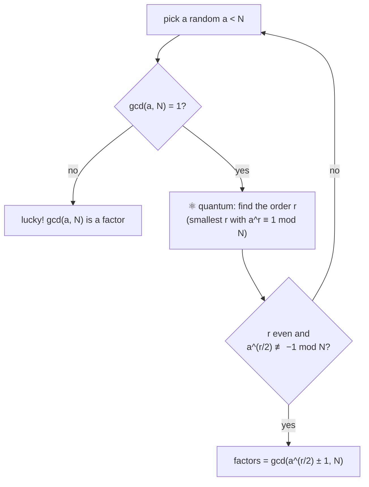

#shors_algorithm
Uses quantum [[Order finding algorithm|order finding]] to find the factors of an integer $N$
## Why it matters
most internet security (**[[RSA]]**) is safe because multiplying 2 big primes is easy, but **un**-multiplying (factoring) the answer is insanely hard for normal computers

Shor's algorithm factors numbers **exponentially faster**, so a big enough quantum computer could break RSA

| | time to factor an $n$ bit number |
|---|---|
| best classical algorithm (number field sieve) | about $e^{\,n^{1/3}}$ (grows super fast) |
| Shor's algorithm | about $n^3$ (a normal polynomial) |

> [!info] how close is it?
> the biggest numbers factored with Shor's on real quantum computers are still tiny (like 15 and 21). breaking real 2048 bit RSA needs around a million noisy qubits or more, way more than exists today. that's why people are already switching to "[[Post-quantum cryptography|post-quantum]]" cryptography, and why [[QKD]] is interesting
## The big picture
most of Shor's algorithm is **classical**, only the order finding needs a quantum computer

the reason this works is in [[Order finding algorithm#why the order lets you factor]]
## Quantum circuit
The quantum circuit consists of 2 Quantum Registers each of 2L qubits
There are 4 main steps in Shor's Algorithm
- [[Hadamard Gate|Hadamard Gates]] in the first Quantum Register
- [[Modular Exponentiation|Modular exponentiation]] [[Unitary Operation]] on both the registers
- [[Quantum Fourier Transform|QFT (aka Quantum Fourier Transform)]] on the first register
- Measure the qubits in the first Register

![[Shor_algo.png]]
### what each step does
1. **Hadamards** → the first register becomes an equal superposition of every $x$ at once
$$
\frac1{\sqrt Q}\sum_{x=0}^{Q-1}|x\rangle|1\rangle
$$
2. **modular exponentiation** → computes $a^x\bmod N$ for **all** $x$ at the same time into the second register
$$
\frac1{\sqrt Q}\sum_{x}|x\rangle|a^x\bmod N\rangle
$$
since $a^x\bmod N$ repeats every $r$, the first register now holds a **periodic** pattern with period $r$
3. **QFT** (the inverse one) → turns that periodic pattern into sharp spikes at multiples of $\frac Qr$ (see [[Fourier Transform#Why it matters for quantum]])
4. **measure** → you land on one of the spikes, which tells you about $r$

> [!note] this is phase estimation
> steps 1–3 are exactly [[Quantum Phase Estimation]] on the "multiply by $a$" gate
## Worked example (factoring 15)
**1.** pick $a=2$. $\gcd(2,15)=1$, so keep going

**2.** quantum part: the powers of 2 mod 15 go $1,2,4,8,1,2,4,8,\ldots$ (period $r=4$, see [[Modular arithmetic]])

with 8 counting qubits ($Q=256$) the measurement gives one of 4 spikes, each 25% of the time

![[Shor_histogram.png]]

**3.** turn the result into $r$ (as a fraction of 256)

| measured | fraction | guess for $r$ | check |
|---|---|---|---|
| 0 | $\frac0{256}$ | nothing | run again |
| 64 | $\frac14$ | 4 | $2^4=16\equiv1$ ✅ |
| 128 | $\frac12$ | 2 | $2^2=4\not\equiv1$ ❌ run again |
| 192 | $\frac34$ | 4 | ✅ |

so half the time it works first try

**4.** classical part: $r=4$ is even and $2^2=4\not\equiv-1$, so
$$
\gcd(2^2-1,\,15)=\gcd(3,15)=3\qquad\gcd(2^2+1,\,15)=\gcd(5,15)=5
$$
$$
15=3\times5\ ✅
$$
example by IBM
![[IBM_demonstrations.png]]
(this is the circuit for exactly this example: 8 counting qubits $C$, 4 work qubits $T$ starting at $|1\rangle$ with an X, and controlled "multiply by 2" and "multiply by 4" gates, see [[Modular Exponentiation]])

see also [[Order finding algorithm]], [[Quantum Phase Estimation]], [[Quantum Fourier Transform]]
