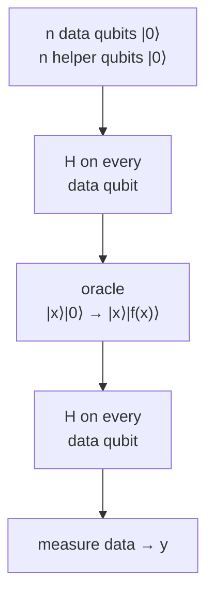

#simons_algorithm #quantum_algorithm #oracle
the algorithm that **inspired** [[Shor's algorithm]]. no real world use, but it was one of the first to show an **exponential** quantum speedup
## the problem
you get a black box function $f$ that takes an $n$ bit string and gives an $n$ bit string. you're promised it's one of these
- **one to one**: every input gives a different output
- **two to one**: there's a secret bit string $s$ where $f(x)=f(x\oplus s)$ for every $x$ (pairs of inputs share an output)

($\oplus$ = bitwise XOR, adding each bit mod 2)

**goal:** find out which one it is, and if it's two to one, find $s$
## the circuit

1. [[Hadamard Gate|Hadamards]] → equal superposition of every $x$
2. the oracle writes $f(x)$ into the helper qubits, which **entangles** them with the data (you don't even need to measure the helpers)
3. Hadamards again → the $x$ and $x\oplus s$ terms **interfere**
4. measure the data qubits → some bit string $y$
> [!important] the key fact
> you can **only** ever measure a $y$ with
> $$
> y\cdot s=y_1s_1\oplus y_2s_2\oplus\ldots\oplus y_ns_n=0
> $$
> every other $y$ cancels out completely (destructive interference). each run gives you one equation about $s$

## finding $s$
run it about $n$ times to get $n-1$ **different** (linearly independent) equations, then solve them with normal linear algebra (mod 2)
> [!example] example: $n=3$, secret $s=110$
> the only outcomes are $000,\ 001,\ 110,\ 111$, each 25% of the time (checked numerically). all of them have $y\cdot s=0$
>
> say you get $001$ and $110$
> - $001\cdot s=0$ → $s_3=0$
> - $110\cdot s=0$ → $s_1\oplus s_2=0$ → $s_1=s_2$
>
> the only non-zero answer is $s=110$ ✅

## how fast

| | number of calls to $f$ |
|---|---|
| classical | about $2^{n/2}$ (you need to stumble on a matching pair) |
| Simon's | about $n$ |

an **exponential** speedup
## the link to Shor's algorithm
same shape of circuit, just with the [[Quantum Fourier Transform|QFT]] instead of Hadamards

| | Simon's | [[Shor's algorithm\|Shor's]] (period finding) |
|---|---|---|
| hidden pattern | $f(x)=f(x\oplus s)$ (a period under XOR) | $f(x)=f(x+r)$ (a normal period) |
| last step | Hadamards | [[Quantum Fourier Transform\|QFT]] |
| answer | the bit string $s$ | the period $r$ → factors of $N$ |

Peter Shor has said Simon's algorithm is what gave him the idea for the factoring algorithm

see also [[Shor's algorithm]], [[Order finding algorithm]], [[Hadamard Gate]]
