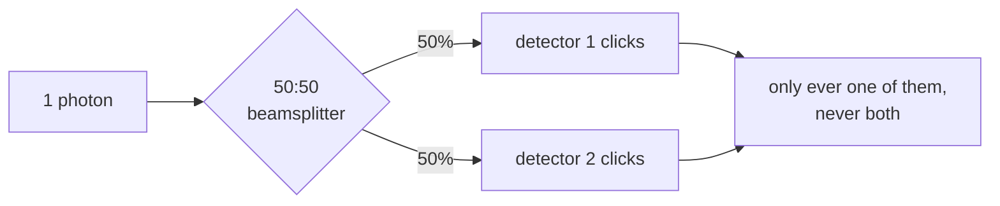

#beamsplitter #optics #polarization
There are 2 kinds of beamsplitters
- regular beamsplitters
- [[Polarization|polarizing]] beamsplitters
## Regular beamsplitters
they split a beam of light into two, part of it goes straight through (transmitted) and part of it gets reflected

![[Regular Beamsplitter.png]]
## [[Polarization|polarizing]] beamsplitters
These are just like regular beamsplitters but it has a polarizer so which way the light goes depends on its [[Polarization|polarization]]
- $|H\rangle$ → one output
- $|V\rangle$ → the other output

(which one gets reflected and which goes through depends on the beamsplitter, usually $|H\rangle$ goes through and $|V\rangle$ gets reflected)
## One photon at a 50:50 beamsplitter
a **50:50** beamsplitter sends half the light each way. but a single photon can't split in half, so what happens?

it goes into a **superposition** of both paths
$$
|\text{in}\rangle\;\longrightarrow\;\frac1{\sqrt2}\big(|\text{transmitted}\rangle+i\,|\text{reflected}\rangle\big)
$$
put a detector on each output and **only one** clicks, 50/50 at random. it's a real quantum coin flip (this is actually how some quantum random number generators work)

(the $i$ is a phase that reflection adds. it doesn't change the 50/50, but it matters when 2 paths meet again)
> [!example]- as a matrix
> treat "which path" as a qubit: port 1 = $|0\rangle$, port 2 = $|1\rangle$
> $$
> B=\frac1{\sqrt2}\begin{bmatrix}1&i\\i&1\end{bmatrix}
> $$
> it's [[Unitary Operation|unitary]] like any gate, so a beamsplitter is basically a [[Quantum gate|quantum gate]] for photons

(one photon, two paths)

## A polarizing beamsplitter is a measurement
put a single photon detector on each output of a polarizing beamsplitter and you've **measured the polarization** in the H/V basis
- detector 1 clicks → $|H\rangle$ (= 0)
- detector 2 clicks → $|V\rangle$ (= 1)

rotate the photon first with a half wave plate and the same setup measures in the D/A basis instead (see [[Polarization#Changing polarization]]). this is the detector in [[BB84]], [[BBM92]] and [[Ekert91]], and how [[Entangled Photons generation and detection|entangled photons get detected]]

see also [[Polarization]], [[Single Photon making and detecting]], [[BB84]]
