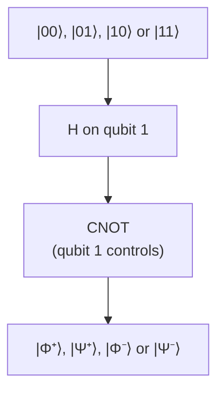

#entanglement #bell_states #two_qubits
the 4 **maximally entangled** 2 qubit states. they show up everywhere: [[Teleportation]], entanglement based [[QKD]], Bell tests, [[Quantum repeaters]]...
## the 4 Bell states
$$
|\Phi^\pm\rangle=\frac1{\sqrt2}\big(|00\rangle\pm|11\rangle\big)\qquad|\Psi^\pm\rangle=\frac1{\sqrt2}\big(|01\rangle\pm|10\rangle\big)
$$
^bell-states

| state | measure both in $0/1$ ($Z$) | the $\pm$ sign |
|---|---|---|
| $\lvert\Phi^+\rangle$ | always the **same** | $+$ |
| $\lvert\Phi^-\rangle$ | always the **same** | $-$ |
| $\lvert\Psi^+\rangle$ | always **opposite** | $+$ |
| $\lvert\Psi^-\rangle$ | always **opposite** | $-$ |

- $\Phi$ vs $\Psi$ → **same** or **opposite** results
- $+$ vs $-$ → a relative phase, which shows up when you measure in the $|+\rangle,|-\rangle$ ($X$) basis instead
- each one on its own is totally random (50/50), only the **pair** is certain. that's what "maximally entangled" means (see [[Defining entanglement]] and [[Entanglement entropy]])
- together the 4 form a **basis**: any 2 qubit state can be written as a mix of them
## making them
[[Hadamard Gate|H]] on the first qubit, then a [[CNOT gate|CNOT]]

| start | → |
|---|---|
| $\lvert00\rangle$ | $\lvert\Phi^+\rangle$ |
| $\lvert01\rangle$ | $\lvert\Psi^+\rangle$ |
| $\lvert10\rangle$ | $\lvert\Phi^-\rangle$ |
| $\lvert11\rangle$ | $\lvert\Psi^-\rangle$ |

(see [[CNOT gate#Example (making a Bell state)]]). with photons, the same states are made with **polarization** instead, eg. $\frac1{\sqrt2}(|HV\rangle+|VH\rangle)$ from a down conversion source, and wave plates switch between them (see [[Entangled Photons generation and detection]])
## Bell state measurement (BSM)
running the circuit **backwards** (CNOT, then H, then measure both) tells you **which** of the 4 Bell states you had. this "Bell state measurement" is the key step in [[Teleportation]] and entanglement swapping ([[Quantum repeaters]])
> [!example] example (from the course quiz)
> Alice and Bob share photons in $|\Phi^+\rangle=\frac1{\sqrt2}(|H\rangle_A|H\rangle_B+|V\rangle_A|V\rangle_B)$. Alice takes hers to the Moon, Bob his to Mars
> - Alice's photon passes a horizontal polarizer and gets detected → it was $H$, so the pair **collapses** to $|H\rangle_A|H\rangle_B$
> - so Bob's photon is now definitely $H$
> - if Bob puts it through a $+45°$ polarizer, it gets through with $\cos^2 45°=50\%$ chance ([[Polarization]])
>
> the collapse happens instantly however far apart they are, but Bob can't **use** it to send a message, his results alone just look random

see also [[Teleportation]], [[Entangled Photons generation and detection]], [[CHSH quantum strategy]], [[Entanglement as a resource]]
