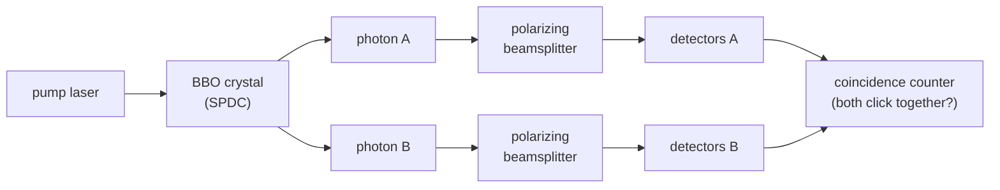

#entanglement #photons #SPDC
## Generation of photons
They use a crystal called **beta barium borate** (BBO)

a laser photon (the pump) goes into the crystal and sometimes splits into **2 photons** with half the energy each. this is called **spontaneous parametric down-conversion** (SPDC)

the 2 photons come out with their [[Polarization|polarizations]] entangled, so measuring one tells you about the other (why that's so strange is in [[Quantum weirdness]])
### what gets conserved
the pump photon's energy and momentum get **shared** between the 2 new photons (usually called the **signal** and the **idler**)
$$
\omega_{\text{pump}}=\omega_{\text{signal}}+\omega_{\text{idler}}
$$
so if the pump is blue light, the pair is 2 red-ish photons with half the frequency each. they also fly out on opposite sides of the beam, which is how you know where to put the detectors
### which entangled state
in the common setup ("type II" SPDC) one photon comes out H and the other V, but you can't tell which is which, so you get
$$
\frac1{\sqrt2}\big(|HV\rangle+|VH\rangle\big)
$$
one of the 4 [[Bell states]] (see [[CNOT gate#Example (making a Bell state)]]). tilting the crystal or adding wave plates changes it into any of the other Bell states

> [!note] it's rare
> only a tiny fraction of pump photons actually split (around 1 in a billion or even fewer), so you need a strong laser to get a useful number of pairs

(the whole setup)

## Detection 
to detect entangled pairs we use a [[Beamsplitters|polarizing beamsplitter]] for each photon, then a [[Single Photon making and detecting|single photon detector]] on each output

we look for **coincidences**: both detectors clicking at the same time means it was an entangled pair
### coincidence counting
- random clicks (dark counts, stray light) happen at random times on each side
- a real pair makes **both** sides click within a tiny time window (nanoseconds)
- so you only keep clicks that come in matching pairs and throw the rest away. this filters out almost all the noise
### checking it's really entangled
measure both photons at different angles and compare, if the results beat the classical limit in a Bell test ([[CHSH game]]) the photons are really entangled. that's exactly what [[Ekert91]] does

used in [[QKD]] methods like [[BBM92]] and [[Ekert91]]

see also [[Quantum weirdness]], [[Bell states]], [[Ekert91]], [[BBM92]]
