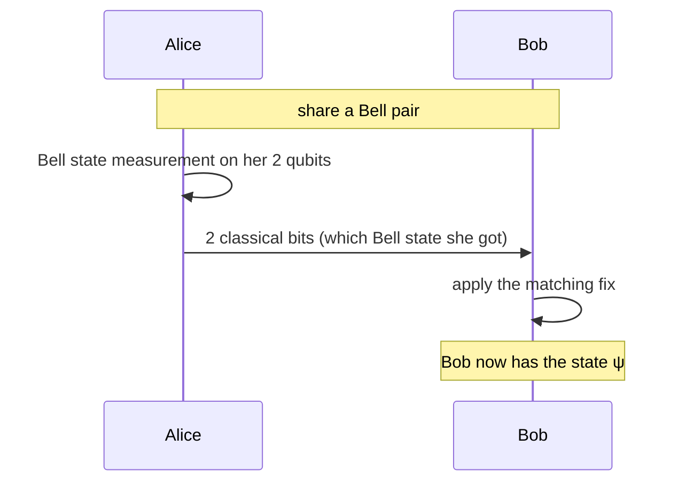

#teleportation #entanglement #bell_states #quantum_communication
how to move a qubit's **state** from Alice to Bob using a shared entangled pair and **2 classical bits**. discovered in 1993 and done in experiments many times since. a basic building block of [[Quantum Communication|quantum communication]]
> [!note] not like sci-fi
> nothing physical travels. only the **quantum information** (the state $\alpha|0\rangle+\beta|1\rangle$) moves from one qubit to another

## the setup
- Alice has a qubit in an unknown state $|\psi\rangle=\alpha|0\rangle+\beta|1\rangle$
- Alice and Bob already share a [[Bell states|Bell pair]], say $|\Phi^+\rangle=\frac1{\sqrt2}(|00\rangle+|11\rangle)$

the 4 Bell states, for reference
![[Bell states#^bell-states]]

## the trick
write the 3 qubit state $|\psi\rangle_1|\Phi^+\rangle_{23}$ in terms of Bell states of **Alice's 2 qubits**
$$
\tfrac12\Big[|\Phi^+\rangle(\alpha|0\rangle+\beta|1\rangle)+|\Phi^-\rangle(\alpha|0\rangle-\beta|1\rangle)+|\Psi^+\rangle(\alpha|1\rangle+\beta|0\rangle)+|\Psi^-\rangle(\alpha|1\rangle-\beta|0\rangle)\Big]
$$
(nothing has happened yet, it's just rewritten). now Bob's qubit already holds a **version** of $|\psi\rangle$ in every term
## the protocol

| Alice's BSM result | Bob's qubit is | Bob applies |
|---|---|---|
| $\lvert\Phi^+\rangle$ | $\alpha\lvert0\rangle+\beta\lvert1\rangle$ | nothing ✅ |
| $\lvert\Phi^-\rangle$ | $\alpha\lvert0\rangle-\beta\lvert1\rangle$ | [[Z gate\|Z]] |
| $\lvert\Psi^+\rangle$ | $\alpha\lvert1\rangle+\beta\lvert0\rangle$ | [[X gate\|X]] |
| $\lvert\Psi^-\rangle$ | $\alpha\lvert1\rangle-\beta\lvert0\rangle$ | [[Y gate\|Y]] (= X then Z, up to a global phase) |

each result happens 25% of the time, and after the fix Bob has **exactly** $|\psi\rangle$ every time (checked numerically)
> [!tip] intuition
> the BSM **compares** Alice's 2 qubits (the original and her half of the pair), and the shared pair links her half to Bob's
> - $\Phi$ result → the original and her half are **correlated**, and her half is correlated with Bob's ($\Phi^+$), so Bob's qubit already **matches** the original's $0/1$ pattern
> - $\Psi$ result → they're **anti-correlated**, so Bob's qubit is **flipped** → an X undoes it
> - a $-$ sign → there's also a phase flip → a Z undoes it

## it doesn't break physics
- **not faster than light**: until Bob gets Alice's 2 bits (sent the normal way, at light speed or slower), he doesn't know which fix to apply, so his qubit looks completely random
- **no cloning** ([[No-cloning theorem]]): the BSM leaves Alice's qubits in a Bell state that has **nothing** to do with $|\psi\rangle$ (each one alone is a 50/50 mix). the original is **destroyed**, so there's only ever one copy
## why it matters: quantum repeaters
photons get lost in optical fibre, and you can't just **amplify** a quantum signal like a normal one because that would copy it (no-cloning again)
- silica fibre is best around **1550 nm**, with about **0.2 dB/km** loss (from scattering at short wavelengths and absorption at long ones)
- the loss adds up with distance: **95%** of photons left after 1 km, **1%** after 100 km, and only **1 in $10^{10}$** after 500 km (100 dB)

![[Fiber_loss.png]]

the fix is **entanglement swapping**: make short entangled links, then a BSM in the middle joins 2 links into one longer one. it's basically **teleporting entanglement**. repeat and nest it to span any distance, then use the long distance pair to teleport a qubit **deterministically**. the losses only hit the part you can retry, never the precious qubit itself

full details in [[Quantum repeaters]] and [[Long-distance quantum communication]]

see also [[Bell states]], [[Quantum repeaters]], [[Entanglement as a resource]], [[QKD]]
