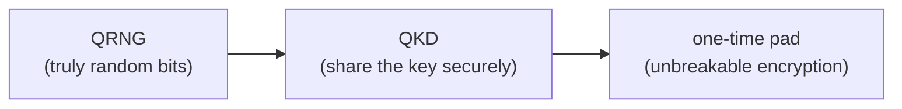

#cryptography #one_time_pad #information_theoretic_security
the only encryption that's **mathematically unbreakable**, if you use it properly
## how it works
Alice and Bob share a secret **random key at least as long as the message**
- **encrypt**: add each message character to the matching key character (modular arithmetic, for bits that's XOR $\oplus$)
- **decrypt**: do the same with the same key

> [!example] with bits
> 
> | | |
> |---|---|
> | message | `1011` |
> | key | `0110` |
> | ciphertext = message ⊕ key | `1101` |
> | ciphertext ⊕ key | `1011` ✅ back to the message |
> 

^otp-example

## why it can't be broken
for **any** message and **any** ciphertext of the same length, there's **some** key that links them. so if the key is truly random, every ciphertext is **equally likely** whatever the message was, and Eve learns **nothing** from intercepting it
> [!important] information-theoretic security
> it's safe even against an eavesdropper with **infinite computing power** (including quantum computers), as long as she doesn't have the key. compare [[RSA]], which is only safe because factoring is slow

## the catches
- the key must be **truly random**. a pseudo-random key from an algorithm can leak information (see [[Quantum random number generators]])
- the key must be **as long as the message** and **never reused**. if 2 messages use the same key, $c_1\oplus c_2=m_1\oplus m_2$ and the key cancels out
- you still have to get the key to the other person **secretly** → this is exactly what [[QKD]] is for

see also [[Quantum random number generators]], [[QKD]], [[Modern cryptography]]
