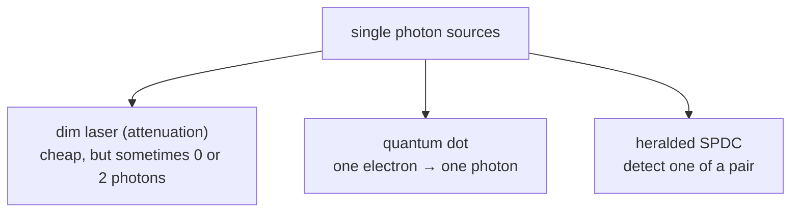
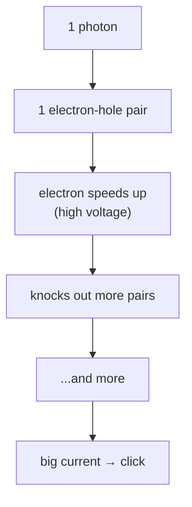

#single_photon #photons #detectors
# Single photon generation
There are two main methods for single photon generation
- Attenuation(aka just making a coherent source of light less intense)
- optically active quantum dot(aka just a crystal with some electron stuff)
This is done so we can [[Polarization|polarize]] a single photon

(3 ways to get single photons)

## Attenuation
Attenuation is making a coherent source of light sooo dim that it might just emit 1 photon (but it's kinda bad cuz most of the time no photons come, and sometimes 2 come at once)

### why dim lasers are a problem
the number of photons in each pulse of a dimmed laser is random (a **Poisson distribution**). if the average is $\mu$ photons per pulse
$$
P(n\text{ photons})=e^{-\mu}\frac{\mu^n}{n!}
$$
![[Photon_statistics.png]]
eg. with $\mu=0.1$
- 0 photons → 90.5% of pulses (wasted)
- 1 photon → 9.0% (what we want)
- 2+ photons → about 0.5%

> [!warning] the 2 photon pulses are dangerous
> if a pulse has 2 identical photons, an eavesdropper can **steal one** and let the other through, so nobody notices. this is called a **photon number splitting attack**. that's why real [[BB84]] systems use tricks like "decoy states" or real single photon sources
## Optically active quantum dot
It's just a tiny piece of semiconductor that can be excited so that the electron will jump to a higher energy state and then come back releasing a photon

since it only has **one** electron to excite, it can only give **one** photon at a time, which is exactly what we want (no 2 photon pulses)
## Heralded photons
another way: make a pair of photons with SPDC (see [[Entangled Photons generation and detection]]) and detect one of them. that click **"heralds"** (announces) that its partner photon exists, so you know exactly when you have one

# Single photon detecting
most of the time they use an **avalanche photodiode** (SPAD, single photon avalanche diode) like the picture below
![[Single photon detection.png]]
so when a photon comes it makes an electron (-) and hole (+) pair, they get separated, and the electron speeds up and breaks more pairs which breaks even more pairs, an avalanche that makes a large current you can measure

(the avalanche)

### what makes a detector good or bad

| property | what it means | why it matters |
|---|---|---|
| **efficiency** | how many photons actually get detected | missed photons = lost key bits |
| **dark counts** | clicks when **no** photon came (from heat or noise) | fake clicks = errors, look like an eavesdropper |
| **dead time** | how long it's "blind" after a click (the avalanche has to be stopped and reset) | limits how fast you can send photons |
| **timing jitter** | how precisely it knows **when** the photon arrived | matters for matching up entangled pairs |

(the avalanche diode can only say "photon or no photon", not **how many**, which is another reason 2 photon pulses are sneaky)

used in [[QKD]] methods like [[BB84]]

see also [[Beamsplitters]], [[Quantum hacking]], [[Increasing the key rate]]
