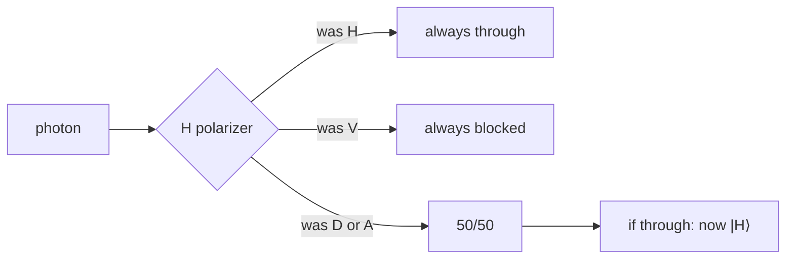

#polarization #photons #optics
## What it is 
Basically the rotation of light waves
there are two types
- Linear polarization
- circular polarization
- (maybe if you want to count it elliptical polarization)
## Linear polarization
there are 4 main types of linear polarization
- Horizontal polarization $|H\rangle$
	- ![[H_polarization.png|500 ]]
- Vertical polarization $|V\rangle$
	- ![[V_polarization.png|500]] 
- Diagonal polarization $|D\rangle$
	- ![[D_polarization.png|500]]
- Antidiagonal polarization $|A\rangle$
	- ![[A_polarization.png|500]]
## Polarizers
Polarizers take chaotic light (like light with ALL polarizations mixed) eg. sunlight and turn it into 1 polarization so if the Polarizer is in the $|H\rangle$ position but the wave incoming is a $|V\rangle$ polarization then it will get blocked however if it's an $|H\rangle$ wave incoming then it will go through 
BUT if an $|D\rangle$ or $|A\rangle$ wave comes through it will have a 50/50 chance that it will go through (this is the quantum part) and if it comes out then it will be in the $|H\rangle$ direction 
That is what makes the quantum nature

(a [[Beamsplitters|polarizing beamsplitter]] is similar but instead of blocking one polarization it sends each one a different way)

Also if you choose two states that are $90^\circ$ degrees apart you can make it into a $|0\rangle$ and the other $|1\rangle$ and the Diagonal would be a like a [[Hadamard Gate]] operation on a regular $|0\rangle$ and the Antidiagonal would be the same as the Diagonal but with a [[Phase shift]] or [[Hadamard Gate]] on state $|1\rangle$ 

(what happens at a horizontal (H) polarizer)

## Polarization as a qubit
a single photon's polarization **is** a qubit

| polarization | as a qubit | on the [[Bloch sphere]] |
|---|---|---|
| horizontal $\lvert H\rangle$ | $\lvert0\rangle$ | top |
| vertical $\lvert V\rangle$ | $\lvert1\rangle$ | bottom |
| diagonal $\lvert D\rangle=\frac1{\sqrt2}(\lvert H\rangle+\lvert V\rangle)$ | $\lvert+\rangle$ | front |
| antidiagonal $\lvert A\rangle=\frac1{\sqrt2}(\lvert H\rangle-\lvert V\rangle)$ | $\lvert-\rangle$ | back |
| right circular $\lvert R\rangle=\frac1{\sqrt2}(\lvert H\rangle+i\lvert V\rangle)$ | $\lvert{+i}\rangle$ | right |
| left circular $\lvert L\rangle=\frac1{\sqrt2}(\lvert H\rangle-i\lvert V\rangle)$ | $\lvert{-i}\rangle$ | left |

(which circular one is called "right" vs "left" depends on the textbook)

> [!note] angles double
> H and V are $90^\circ$ apart in real life but **opposite** ($180^\circ$) on the Bloch sphere. every real angle doubles on the Bloch sphere, same as in the [[CHSH quantum strategy]]
## Malus's law
how likely a photon is to get through a polarizer that's at angle $\theta$ to its polarization
$$
P(\text{through})=\cos^2\theta
$$
![[Malus_law.png]]
- $\theta=0^\circ$ (same direction) → always gets through
- $\theta=45^\circ$ (eg. $|D\rangle$ into an H polarizer) → 50/50, that's the quantum part from above
- $\theta=90^\circ$ (eg. $|V\rangle$ into an H polarizer) → never

this is the same $\cos^2$ rule as the qubit probability $|\langle\phi|\psi\rangle|^2$ (see [[Dirac notation]]) and the $\cos^2(22.5^\circ)\approx85\%$ in the [[CHSH quantum strategy]]
## Circular polarization
instead of wiggling along a line, the wave's direction **spins around** as it travels. it's a superposition of H and V with a $90^\circ$ ($i$) phase between them
## Changing polarization
- a **half wave plate** rotates linear polarization (eg. turns H into D). it's like a gate on the photon qubit
- a **quarter wave plate** turns linear into circular polarization

this is how [[BB84]] switches between the H/V and D/A bases
