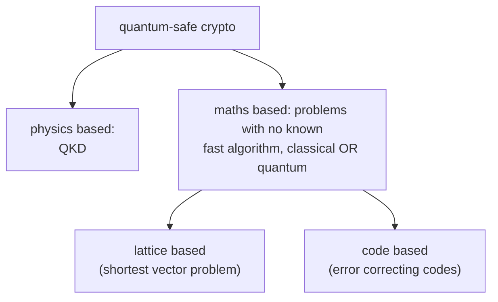

#cryptography #post_quantum #quantum_safe
crypto that stays safe even when big quantum computers exist. follows on from [[Modern cryptography]] and [[Shor's algorithm]]
## the problem
- [[Shor's algorithm]] breaks the **one-way functions** behind public key crypto ([[RSA]], Diffie–Hellman). that's a real quantum advantage
- **symmetric** crypto (like AES) is **not** in big trouble. [[Grover's algorithm]] only speeds up guessing the key by a square root, so doubling the key length fixes it
## why start now?
> [!important] "harvest now, decrypt later"
> someone can **record** encrypted data today and decrypt it once they have a quantum computer. so what matters is whether the data still needs to be secret by then
>
> Michele **Mosca**'s way to think about it: if
> $$
> \text{how long the data must stay secret}+\text{how long it takes to switch systems}>\text{time until a quantum computer}
> $$
> then you're already too late

Mosca estimated the chance of a quantum computer that can break **RSA-2048** at **1 in 7 by 2026** and **1 in 2 by 2031**. these were informed guesses (when will we have fault tolerant, scalable qubits, how many are needed, how fast can it scale)

- **2015**: the NSA's Information Assurance Directorate said it would move to quantum resistant algorithms
- **2016**: **NIST** asked for proposals for post-quantum public key algorithms, to pick new standards
## the options

| | how it works | good | bad |
|---|---|---|---|
| **[[QKD]]** | shares keys using quantum physics (eg. [[BB84]]) | **provably** secure, no assumptions about how much computing power Eve has | real hardware and software can still be attacked ([[Quantum hacking]]), needs special equipment |
| **lattice based** | a **lattice** is a grid of points repeating in $n$ dimensions. hard problem: find the **shortest** non-zero vector in it | runs on normal computers | security rests on a problem being hard (no proof) |
| **code based** | the public key **adds random noise** to the message, the private key is an **error correcting code** that removes it | same | same |

> [!warning] switching won't be easy
> the new schemes probably **won't work with existing systems**, so new hardware and software will be needed, at big cost. it needs careful planning years ahead

> [!info] update since the course
> NIST published its first post-quantum standards in **August 2024**: **ML-KEM** (from CRYSTALS-Kyber, lattice based, for sharing keys) and **ML-DSA** (from Dilithium, lattice based) and **SLH-DSA** (from SPHINCS+, hash based) for digital signatures. in 2025 it also picked **HQC**, a code based scheme, as a backup key sharing standard

see also [[Modern cryptography]], [[RSA]], [[QKD]], [[One-time pad]]
