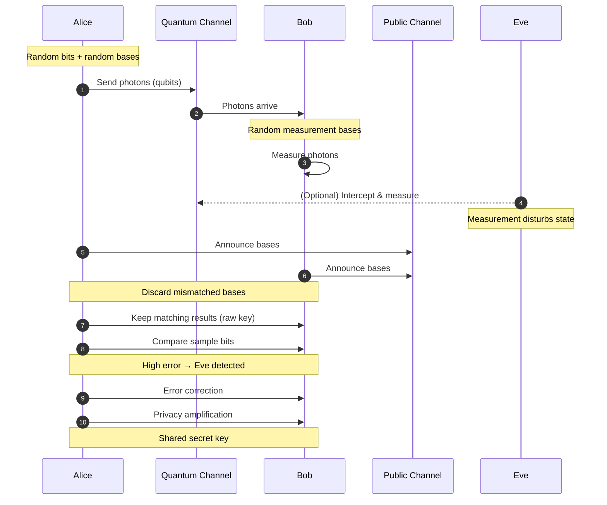

#QKD #BB84
[[BB84]] is a [[QKD]] method which uses [[Polarization]] of [[Single Photon making and detecting|single photons]] unlike [[BBM92]] and [[Ekert91]]

named after Bennett and Brassard, who came up with it in 1984. it was the **first** QKD protocol
## the steps
1. Alice picks a random **bit** (0 or 1) and a random **basis** (+ or ×) for each photon
2. she sends a photon with the matching [[Polarization|polarization]]

| bit | + basis | × basis |
|---|---|---|
| 0 | ↔ $\lvert H\rangle$ | ↗ $\lvert D\rangle$ |
| 1 | ↕ $\lvert V\rangle$ | ↖ $\lvert A\rangle$ |

3. Bob measures each photon in his **own** random basis (with a [[Beamsplitters#A polarizing beamsplitter is a measurement|polarizing beamsplitter]])
   - same basis as Alice → he gets her bit exactly
   - different basis → 50/50 random result (see [[Polarization#Malus's law]])
4. they announce their **bases** (not the bits) and keep only the rounds where they matched (about half)
5. they compare a few of the kept bits to check for errors, then do error correction and privacy amplification (see [[QKD#the steps every method shares]])

![[BB84.png]]
This picture basically explains it (above and below)
## catching Eve
the simplest attack is **intercept-resend**: Eve measures every photon in a random basis and sends Bob a new photon matching her result

> [!important] Eve causes 25% errors
> look only at the rounds Alice and Bob keep (they used the same basis)
> - half the time Eve guessed the **right** basis → she gets the bit, resends it perfectly, no error
> - half the time she guessed **wrong** → she sends Bob a photon in the wrong basis, so his result is 50/50 → wrong half of those times
>
> $$
> P(\text{error})=\frac12\times0+\frac12\times\frac12=\frac14=25\%
> $$
> without Eve (and with perfect equipment) there'd be 0 errors, so she's easy to spot

in real life some errors always happen from noise, so there's a limit: if the error rate is below about **11%** they can still make a secure key, above it they throw everything away

also this diagram