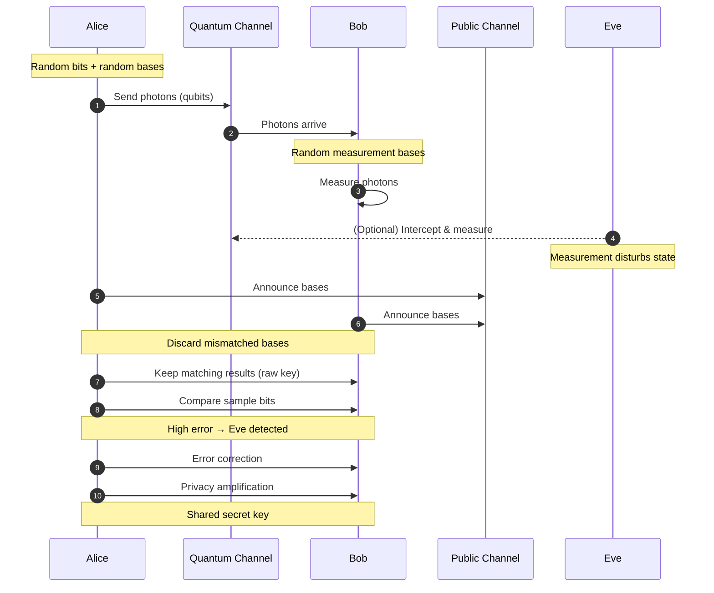

#QKD #BB84
[[BB84]] is a [[QKD]] method which uses [[Polarization]] of [[Single Photon making and detecting|single photons]] unlike [[BBM92]] and [[Ekert91]]

![[BB84.png]]
This picture basically explains it (above and below)

also this diagram