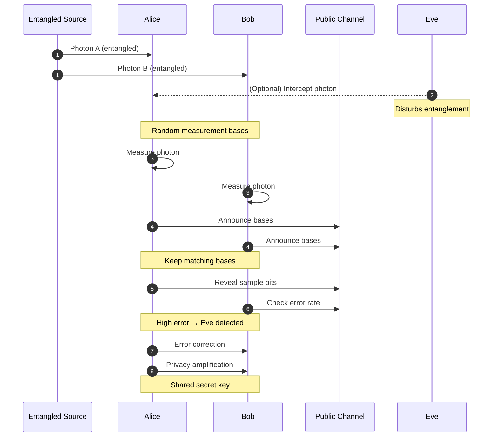

#QKD #BBM92 #entanglement
![[Course 2/Week 2/Images/BBM92.png]]
This is the [[BBM92]] protocol it is a part of [[QKD]]
so in here we need another person to supply [[Entangled Photons generation and detection|entangled photons]] just like [[Ekert91]] unlike [[BB84]]

 