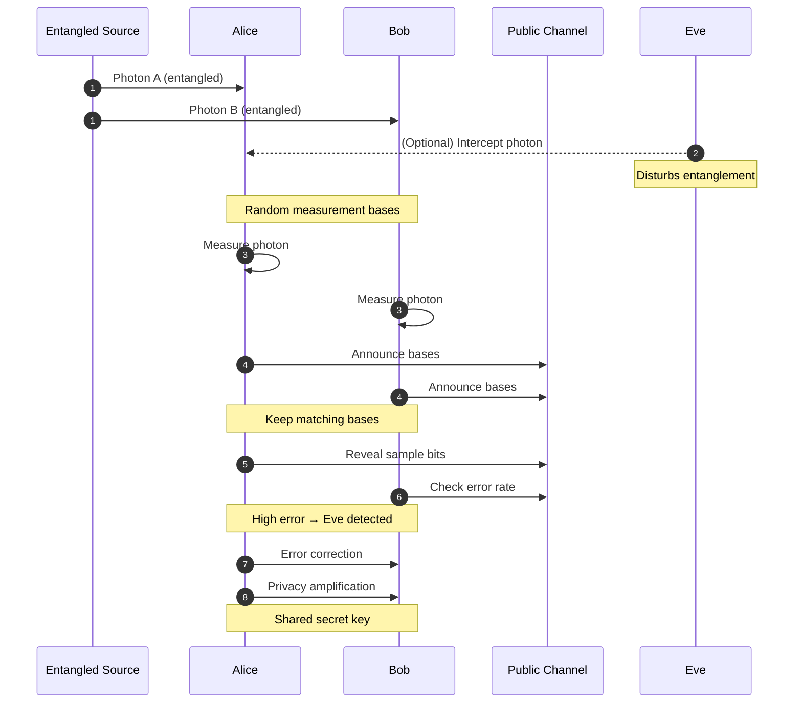

#QKD #BBM92 #entanglement
![[Course 2/Week 2/Images/BBM92.png]]
This is the [[BBM92]] protocol it is a part of [[QKD]]
so in here we need another person to supply [[Entangled Photons generation and detection|entangled photons]] just like [[Ekert91]] unlike [[BB84]]

named after Bennett, Brassard and Mermin (1992). it's basically [[BB84]] but with entangled pairs
## the steps
1. a source (in the middle) sends one photon of an entangled pair to Alice and the other to Bob, eg. in the state $\frac1{\sqrt2}(|HH\rangle+|VV\rangle)$
2. Alice and Bob **each** pick a random basis (H/V or D/A) and measure
3. they announce their bases and keep the rounds where they matched
4. same basis → **same result** (the entangled state gives matching answers in both bases, like in the [[CHSH quantum strategy#the key fact]]), so those results become the key
5. check some bits for errors, then error correction and privacy amplification (see [[QKD#the steps every method shares]])

> [!tip] nobody picks the key
> in BB84 Alice chooses the bits. here **nobody** does: the key only appears when Alice and Bob measure, it's random because quantum measurements are random
## vs BB84
- the maths ends up almost the same as BB84, and Eve gets caught the same way (by the error rate)
- the source can be **in the middle**, so each photon only travels half the distance
- unlike [[Ekert91]] it doesn't do a [[CHSH game|Bell test]], it just checks the error rate

see also [[QKD]], [[BB84]], [[Ekert91]]
