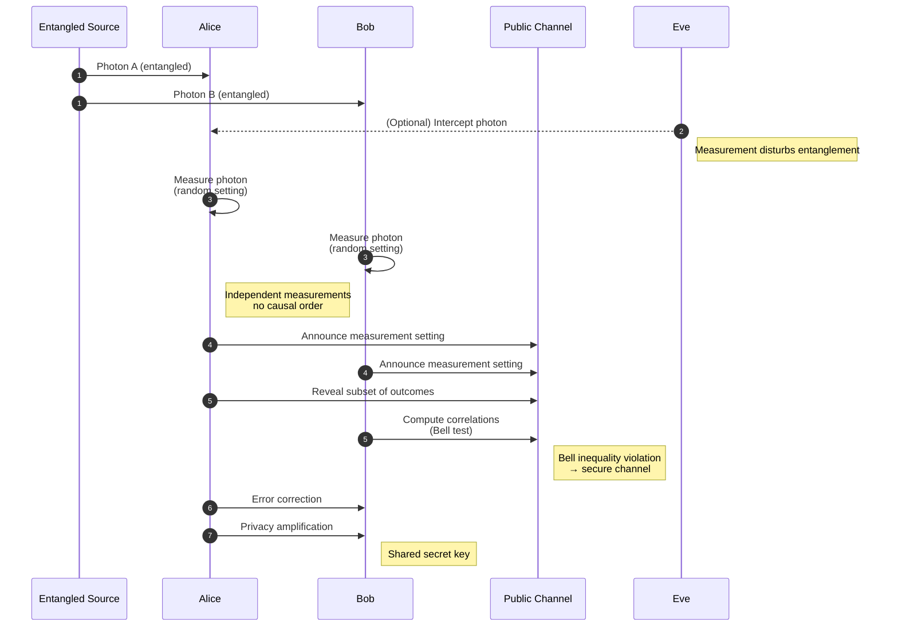

#QKD #Ekert91 #entanglement
![[Ekert91.png]]
This is [[Ekert91]] just like [[BBM92]] it uses [[Entangled Photons generation and detection|Entangled Photons]] and it is also a part of [[QKD]] unlike [[BB84]]

the Bell test it uses is the [[CHSH game]]: if Alice and Bob's results win more than 75% of the time the photons are really entangled, so nobody messed with them (see [[CHSH quantum strategy]])

