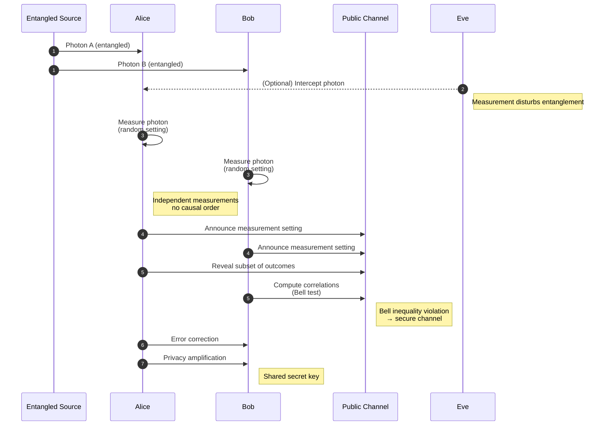

#QKD #Ekert91 #entanglement
![[Ekert91.png]]
This is [[Ekert91]] just like [[BBM92]] it uses [[Entangled Photons generation and detection|Entangled Photons]] and it is also a part of [[QKD]] unlike [[BB84]]

the Bell test it uses is the [[CHSH game]]: if Alice and Bob's results win more than 75% of the time the photons are really entangled, so nobody messed with them (see [[CHSH quantum strategy]])

named after Artur Ekert (1991). the first QKD protocol based on **entanglement** and Bell's theorem (see [[Quantum weirdness]])
## the steps
1. a source sends one photon of each entangled pair to Alice and one to Bob
2. Alice measures at one of **3** random angles, and so does Bob (different sets of angles for each)
3. they announce their angles
4. rounds where they used the **same** angle → results match → these become the **key**
5. rounds with **different** angles → they reveal these results and use them for a **Bell test**
6. if the Bell test passes → the photons were really entangled → no eavesdropper → error correction and privacy amplification (see [[QKD#the steps every method shares]])
## the Bell test
the different-angle rounds are exactly the [[CHSH game]]. the score is usually written as a number $S$
$$
S=4\,(2\,P_{\text{win}}-1)
$$

| | $P_{\text{win}}$ | $S$ |
|---|---|---|
| best classical (or Eve measured the photons) | 75% | 2 |
| perfect entanglement | $\cos^2\frac\pi8\approx85.4\%$ | $2\sqrt2\approx2.83$ |

so Alice and Bob want $S$ close to $2\sqrt2$. if Eve measures the photons she breaks the entanglement and $S$ drops to 2 or below
> [!important] why this is extra safe
> in [[BB84]] and [[BBM92]] you have to trust your equipment. in Ekert91 the Bell test proves the photons are entangled **no matter where they came from**, so even a source made by Eve can't fool it. this idea leads to "device independent" QKD (see [[Quantum hacking#fix 2, device independent (DI) QKD]])

