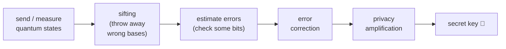

#QKD
QKD or quantum key distribution is a method to securely exchange a key, and if an eavesdropper (Eve) comes in the middle then we can tell, because measuring a quantum state disturbs it
## methods
- [[BB84]] → uses [[Polarization|polarized]] [[Single Photon making and detecting|single photons]]
- [[BBM92]] → uses [[Entangled Photons generation and detection|entangled photons]]
- [[Ekert91]] → uses [[Entangled Photons generation and detection|entangled photons]] + a [[CHSH game|Bell test]]
## why it's secure
normal encryption is safe because some maths problem is **hard** (like factoring, which [[Shor's algorithm]] could break). QKD is safe because of **physics**
- **measuring disturbs**: if Eve measures a photon in the wrong basis she changes it, which causes errors Alice and Bob can spot
- **no-cloning theorem**: you can't make a perfect copy of an unknown quantum state, so Eve can't secretly copy the photon and measure the copy
- **entanglement is private**: if Alice and Bob's photons are strongly entangled (they beat the classical limit in the [[CHSH game]]), nobody else can be correlated with them
> [!note] QKD only makes the key
> QKD just gives Alice and Bob the same secret random key. they then use it to encrypt their actual message with normal encryption (with a key as long as the message, a "one time pad", it's unbreakable)
## the steps every method shares

1. **quantum part**: send and measure photons in random bases
2. **sifting**: announce the bases (not the results!) and only keep the rounds where the bases matched
3. **error estimation**: compare a random sample of bits publicly to get the error rate (the **QBER**). too many errors → someone was listening → start over
4. **error correction**: fix the few leftover differences between Alice's and Bob's keys
5. **privacy amplification**: shrink the key with some clever maths so that whatever tiny bit Eve might know becomes useless
## comparing the methods
| | [[BB84]] | [[BBM92]] | [[Ekert91]] |
|---|---|---|---|
| year | 1984 | 1992 | 1991 |
| photons | single photons from Alice | entangled pairs from a source | entangled pairs from a source |
| bases | H/V and D/A | H/V and D/A | 3 angles each |
| how Eve is caught | error rate | error rate | Bell test ([[CHSH game]]) |
| needs a trusted source? | Alice is the source | yes | no, the Bell test checks it |
## in real life
- photons get absorbed in optical fibre, so fibre QKD only reaches a few hundred km
- to go further you need **quantum repeaters** (still being developed) or **satellites** (China's Micius satellite did QKD between ground stations over 1000 km apart)