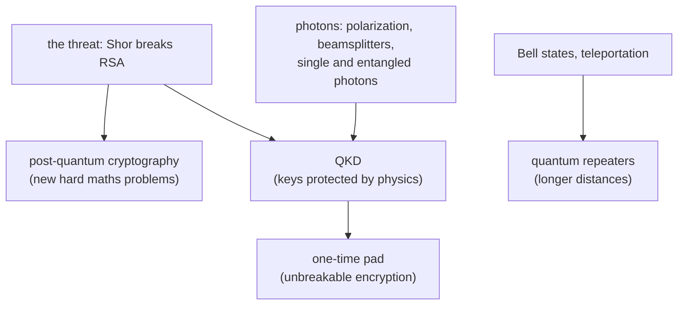

#cryptography #QKD #photons #entanglement
Course 2, Week 2: **quantum cryptography**. staying safe from quantum computers, either with new maths or with physics (sending keys on single photons)

## the problem and the maths answer
- [[Post-quantum cryptography]] → lattice and code based schemes, "harvest now, decrypt later"
- [[One-time pad]] → the only provably unbreakable encryption, if you have a random shared key
## photons
- [[Polarization]] → H/V and D/A, Malus's law
- [[Beamsplitters]] → splitting and routing photons
- [[Single Photon making and detecting]] → sources and detectors
- [[Entangled Photons generation and detection]] → down conversion and Bell state measurement
## QKD
- [[QKD]] → the hub: the steps every protocol shares
- [[BB84]], [[BBM92]], [[Ekert91]]
## randomness and entanglement
- [[Quantum random number generators]] → true randomness, self-checking with Bell tests
- [[Bell states]] → the 4 maximally entangled states
- [[Teleportation]] → moving a qubit with an entangled pair + 2 bits, and quantum repeaters

previous week: [[Cryptography and Shor's algorithm]] · next week: [[Simulating quantum systems]]
