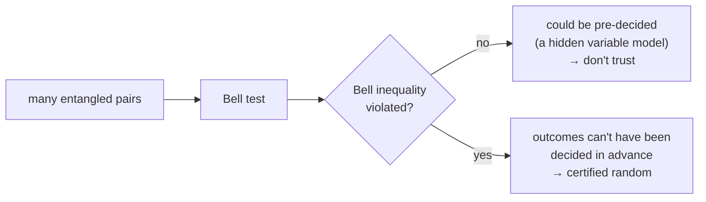

#random_numbers #QRNG #cryptography #bell_test
where do **truly random** numbers come from? quantum mechanics is one of the only real sources
## why random numbers matter
- **cryptography**: keys (eg. the [[One-time pad]] needs a truly random key)
- **tests of physics**: eg. choosing measurement settings in a Bell test ([[CHSH game]])
- **simulations**: Monte Carlo methods
## pseudo-random numbers (PRNG)
most computers use a **pseudo-random** number generator: an algorithm that starts from a secret **seed** and makes numbers that **look** random, but are completely **deterministic**
> [!example] the middle-square method
> square the number, take the **middle** 4 digits, repeat
>
> seed $3452$ → $3452^2=11\underline{9163}04$ → next number $9163$
>
> seed $0540$ → $2916$ → $5030$ → $3009$ → $0540$ → ... it's **back where it started** after 4 steps (checked numerically)

> [!warning] what goes wrong with PRNGs
> - **state compromise extension**: if Eve learns one number, she can work out **every past and future** number
> - they **repeat** eventually, which leaks information
> - **short seeds**: eg. a 16 bit key made from a 4 bit seed (4 rounds of middle-square stuck together). Eve only has to try $2^4=16$ seeds instead of $2^{16}=65536$ keys

## quantum random numbers (QRNG)
simplest version: make a qubit in the superposition
$$
|\psi\rangle=\frac1{\sqrt2}\big(|0\rangle+|1\rangle\big)
$$
and measure it in the $|0\rangle,|1\rangle$ basis. the answer is 0 or 1 with 50% each, and it's **impossible to predict, even in principle** (see [[Probability and expectation values]])
> [!question] but can you trust the box?
> from the outside you can't easily tell if a QRNG is working properly
> - it could be **rigged** to output numbers that look random but were supplied by someone else
> - or the superposition might have **collapsed early**, so the output is really just classical noise, predictable in principle

## self-checking QRNGs (using a Bell test)
use an entangled [[Bell states|Bell state]] like $|\Phi\rangle=\frac1{\sqrt2}(|00\rangle+|11\rangle)$ and run a **Bell test** on lots of copies: each qubit is measured in one of 2 ways, each with 2 outcomes, and you check the statistics against a **Bell inequality** (see [[CHSH game]] and [[CHSH quantum strategy]])

- if the results **satisfy** the Bell inequality, they could be explained by a **deterministic local hidden variable model**: every outcome decided ahead of time, just hidden from us
- if they **violate** it, no such model works, so the outcomes really are decided **at the moment of measurement**
- the **bigger the violation**, the **more randomness** is guaranteed, without needing to trust how the device was built

see also [[One-time pad]], [[CHSH game]], [[Bell states]], [[QKD]]
