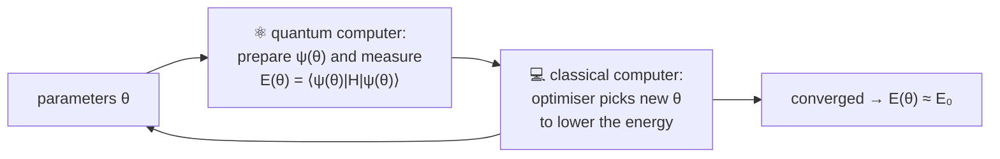

#VQE #variational #hybrid_algorithm #chemistry #NISQ
**Variational Quantum Eigensolver**: find the **ground state energy** of a molecule using a quantum computer and a classical computer working together. made for today's noisy machines ([[NISQ]]). part of [[Simulating quantum systems]]
## why not just use phase estimation?
[[Quantum Phase Estimation#finding energies (Course 2 Week 3)|phase estimation]] gets energies to any accuracy, but high accuracy needs **long circuits with lots of gates** (high depth), which need long coherence times. VQE uses **short** (shallow) circuits with tunable, analog parameters instead

| | phase estimation | VQE |
|---|---|---|
| circuit depth | deep | shallow |
| accuracy | as good as you want (with enough qubits and time) | as good as your guess circuit (the ansatz) allows |
| hardware | error corrected | works on noisy machines today |

## the key idea: the variational principle
for **any** state $|\psi\rangle$
$$
\langle\psi|H|\psi\rangle\ge E_0
$$
the average energy of any state is **never below** the true ground state energy $E_0$. so you can just try lots of states and keep the lowest energy: the lower you get, the closer you are
## the loop

1. a circuit with tunable gates makes a **trial state** (the **ansatz**) $|\psi(\theta)\rangle$
2. the quantum computer measures its energy $E(\theta)=\langle\psi(\theta)|H|\psi(\theta)\rangle$
3. a classical **optimiser** changes $\theta$ to lower the energy
4. repeat until it stops improving
> [!important] which part is classical?
> the **parameter optimisation** runs on the classical computer. preparing the state and measuring the energy run on the quantum one

## measuring the energy: Hamiltonian averaging
$H$ is a sum of Pauli strings ([[Hamiltonian#why it's hard to simulate]]), and you can't measure them all at once. so you
- measure each group of terms **separately**, in its own basis (eg. rotate before measuring, like in [[State tomography]])
- repeat each one **many times** to get good averages
- add them up with their weights

this is why VQE needs lots of runs even for one value of $\theta$
## example: the hydrogen molecule (H₂)
from O'Malley et al. 2016 (in the course folder): H₂ in 2 qubits is
$$
H=g_0I+g_1Z_0+g_2Z_1+g_3Z_0Z_1+g_4X_0X_1+g_5Y_0Y_1
$$
^h2-hamiltonian

where the numbers $g_i$ depend on the distance $R$ between the 2 atoms. the ansatz has just **1 parameter**
$$
|\psi(\theta)\rangle=e^{-i\theta X_0Y_1}|\text{HF}\rangle
$$
starting from the **Hartree–Fock** state (the simple classical chemistry guess). I simulated it using the paper's own table of $g_i$ values
![[VQE_H2.png]]
- **left**: at $R=0.75$ Å, the energy is a smooth curve in $\theta$, and a simple optimiser slides down to the true ground state ($-1.1456$ Hartree) in a few steps
- **right**: doing that at every $R$ traces out the molecule's **energy curve**. the minimum is the bond length, and pulling the atoms apart gives the energy to break the bond
> [!note] VQE beats the classical guess
> Hartree–Fock gives $-1.1246$ Hartree at $0.75$ Å, VQE gives $-1.1456$. the difference ($0.021$ Hartree) looks tiny, but **chemical accuracy** is $0.0016$ Hartree (1 kcal/mol), so it matters a lot. the real experiment got the energy to break the bond right to within chemical accuracy
>
> (numbers checked numerically)

## real demonstrations

| hardware | molecules |
|---|---|
| superconducting qubits | H₂, LiH, BeH₂ (up to 6 qubits, see [[Simulating quantum systems#papers from the course]]) |
| trapped ions | H₂, LiH |
| photons | HeH⁺ (the very first VQE, 2014) |

> [!tip] why VQE fits noisy hardware
> short circuits = less time for errors. and the classical optimiser can partly **adapt** to systematic errors, because it just looks for whatever $\theta$ gives the lowest measured energy (the H₂ paper found this robustness in their data)

the same hybrid idea is used for optimisation problems in [[QAOA]]

see also [[Hamiltonian]], [[Hamiltonian simulation]], [[QAOA]], [[NISQ]]
