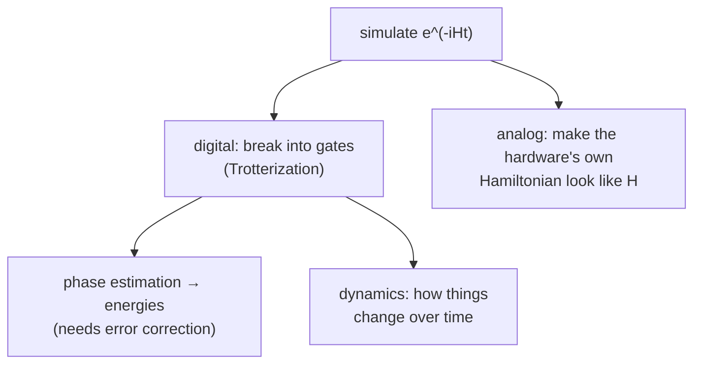

#hamiltonian_simulation #quantum_simulation
the core problem of quantum simulation: **make a quantum computer act like another quantum system**. part of [[Simulating quantum systems]]
## the problem
given a [[Hamiltonian]] $H$ (the system you care about), a time $t$ and an allowed error $\varepsilon$, build a circuit that does
$$
U(t)=e^{-iHt}
$$
to within $\varepsilon$ (it's just the solution of the Schrödinger equation, with $\hbar=1$)
![[Hamiltonian#^time-evolution]]

then you can
- watch how the system **changes in time** (dynamics)
- find its **energies**, by feeding $U$ into [[Quantum Phase Estimation#finding energies (Course 2 Week 3)|phase estimation]]
## why a quantum computer helps

| | classical | quantum |
|---|---|---|
| storing the state of $n$ spins | $2^n$ numbers | $n$ qubits |
| one time step | multiply by a $2^n\times2^n$ matrix | a polynomial number of gates (for local Hamiltonians) |

this works because real Hamiltonians are usually **local**: a sum of terms that each touch only a few particles (neighbours interacting). each term is easy to turn into gates, and [[Trotterization]] glues them together
![[Trotterization#^lie-product]]

## the approaches

- **digital**: works for any $H$ on a universal computer, but deep circuits
- **analog**: eg. trapped ions or ultra cold atoms whose natural interactions already look like a magnet model. less flexible but much bigger today (eg. the 53 ion simulator in [[Simulating quantum systems#papers from the course]])
- for **ground state energies** on noisy hardware, the hybrid [[VQE]] avoids long evolutions entirely
> [!example] from this week
> - [[Particle in a box]]: kinetic + potential energy, simulated by alternating between position and momentum basis with the QFT
> - the hydrogen molecule: a 2 qubit Pauli Hamiltonian, see [[VQE]]

see also [[Trotterization]], [[Hamiltonian]], [[Quantum simulation]], [[VQE]]
