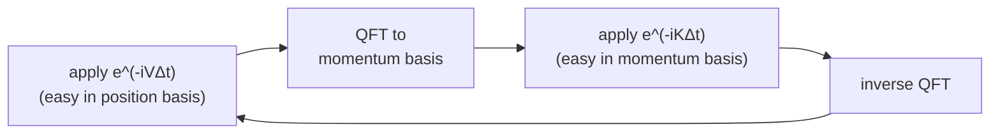

#particle_in_a_box #schrodinger_equation #hamiltonian
one of the few quantum systems you can solve **exactly** by hand, so it's the classic warm up. part of [[Simulating quantum systems]]
## the setup
a particle of mass $m$ can move freely along a line between $x=0$ and $x=a$, but can't get out
- inside the box: $V(x)=0$
- outside: $V(x)=\infty$ (infinitely high walls), so the wavefunction is $0$ there

inside, the (time independent) Schrödinger equation with the [[Hamiltonian]] is
$$
\hat H\psi(x)=\Big(\frac{\hat p^2}{2m}+\hat V\Big)\psi(x)=-\frac{\hbar^2}{2m}\frac{\partial^2}{\partial x^2}\psi(x)=E\,\psi(x)
$$
## solving it
the general solution is
$$
\psi(x)=A\sin(kx)+B\cos(kx)\qquad k^2=\frac{2mE}{\hbar^2}
$$
the walls fix $A$ and $B$
1. $\psi(0)=0$ → $B=0$
2. $\psi(a)=0$ → $\sin(ka)=0$ → $ka=n\pi$ for $n=1,2,3,\ldots$

so only **certain energies** are allowed
$$
E_n=\frac{n^2\pi^2\hbar^2}{2ma^2}\qquad\psi_n(x)=\sqrt{\frac2a}\,\sin\Big(\frac{n\pi x}a\Big)
$$
> [!important] quantized energy
> $n$ is the **quantum number**. the energy goes up as $n^2$: $E_1,\ 4E_1,\ 9E_1,\ 16E_1,\ldots$ and it can never be $0$ (the particle always jiggles, even in its lowest state)

the $\sqrt{\frac2a}$ makes it **normalized**: $\int_0^a|\psi_n|^2dx=1$, ie. the particle is definitely somewhere in the box
![[Particle_in_a_box.png]]
(the $n$th state has $n$ bumps. the particle isn't at one point, it's **spread out** (delocalized) according to $|\psi_n|^2$)
## 2D and 3D boxes
in a 2D box of size $a_x\times a_y$, **separation of variables** splits it into 2 separate 1D problems: $\psi(x,y)=X(x)\,Y(y)$. plugging in gives
$$
\underbrace{-\frac{\hbar^2}{2m}\frac1X\frac{d^2X}{dx^2}}_{\text{only depends on }x}+\underbrace{\Big(-\frac{\hbar^2}{2m}\frac1Y\frac{d^2Y}{dy^2}\Big)}_{\text{only depends on }y}=E
$$
if 2 things that depend on **different** variables always add up to a constant, each must be a constant by itself. so
$$
E=\frac{\pi^2\hbar^2}{2m}\Big(\frac{n_x^2}{a_x^2}+\frac{n_y^2}{a_y^2}\Big)\qquad\psi=\frac2{\sqrt{a_xa_y}}\sin\Big(\frac{n_x\pi x}{a_x}\Big)\sin\Big(\frac{n_y\pi y}{a_y}\Big)
$$
3D is the same with a third factor for $z$ (and normalization $\sqrt{\frac8{a_xa_ya_z}}$)
> [!tip] square box
> if $a_x=a_y$, then $(n_x,n_y)=(1,2)$ and $(2,1)$ have the **same energy**. different states, same energy = **degenerate**

## simulating it on a quantum computer
position is continuous, but you can chop the box into $2^n$ points and store the wavefunction in $n$ qubits: $|\psi\rangle=\sum_x\psi(x)|x\rangle$. a superposition of a **discrete** set of states

kinetic energy is easy in the **momentum** basis and potential energy in the **position** basis, and the [[Quantum Fourier Transform|QFT]] switches between them. alternating small steps of each is exactly [[Trotterization]] with $A=V$ and $B=K$
![[Trotterization#^lie-product]]

> [!warning] you need both terms
> the Hamiltonian needs the **kinetic** energy term too, not just $V(x)$. inside the box $V=0$, so without the kinetic term nothing would happen at all

see also [[Hamiltonian]], [[Trotterization]], [[Quantum Fourier Transform]]
