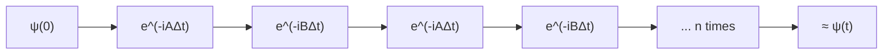

#trotterization #hamiltonian_simulation #lie_product_formula
how to run $e^{-iHt}$ when $H$ is a **sum** of simpler pieces that don't commute. the main tool of digital [[Hamiltonian simulation]]
## the problem
often $H$ itself is hard to implement, but it splits into easy parts
$$
H=\sum_k H_k
$$
you'd love to just do each part separately, but if they **don't commute** ($[A,B]=AB-BA\ne0$)
$$
e^{-i(A+B)t}\ne e^{-iAt}\,e^{-iBt}
$$
(we set $\hbar=1$ to keep things tidy)

the exact relation is the **Baker–Campbell–Hausdorff** formula
$$
e^{A}e^{B}=e^{A+B+\frac12[A,B]+\frac1{12}[A,[A,B]]-\frac1{12}[B,[A,B]]+\ldots}
$$
the extra commutator terms are the error you make by splitting
## the fix: the Lie product formula
$$
e^{-i(A+B)t}=\lim_{n\to\infty}\Big(e^{-iAt/n}\,e^{-iBt/n}\Big)^n
$$
^lie-product

chop time into $n$ tiny steps of $\Delta t=\frac tn$. in each step do a little bit of $A$, then a little bit of $B$, and repeat $n$ times

- the commutator error in each step is about $\Delta t^2$, and there are $n$ steps, so the total error shrinks like $\frac{t^2}n$
- in the limit $n\to\infty$ it's **exact**. in practice you stop at some finite $n$, and that finite version is called the **Trotter–Suzuki** expansion
- it works for **any number** of terms $H_1+H_2+\ldots+H_k$, not just 2
## better: the symmetric (2nd order) version
do half a step of $A$, a full step of $B$, then half of $A$ again
$$
e^{-i(A+B)t}\approx\Big(e^{-iA\frac{\Delta t}2}\,e^{-iB\Delta t}\,e^{-iA\frac{\Delta t}2}\Big)^n
$$
the leading errors cancel, so it shrinks like $\frac1{n^2}$ instead of $\frac1n$, for basically the same cost
![[Trotter_error.png]]
(my simulation: 64 steps get the 1st order version to ~1% error, the 2nd order one to ~0.01%)
## turning each piece into gates
each term is usually a simple Pauli string, which becomes a short circuit. eg. an interaction between 2 qubits
$$
e^{-i\theta Z\otimes Z}=\text{CNOT}\cdot\big(I\otimes R_z(2\theta)\big)\cdot\text{CNOT}
$$
the CNOT copies the **parity** of the 2 qubits onto the second one, the $R_z$ gives a phase depending on it, and the second CNOT undoes the copy ([[CNOT gate]], [[Phase shift]])
> [!warning] the trade-off
> ==more steps = more accurate, but also **more gates**, and on noisy hardware every gate adds errors ([[NISQ]]).== that's why deep Trotter circuits need error corrected machines, and why [[VQE]] was invented

see also [[Hamiltonian simulation]], [[Hamiltonian]], [[Particle in a box]]
