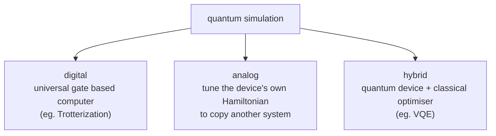
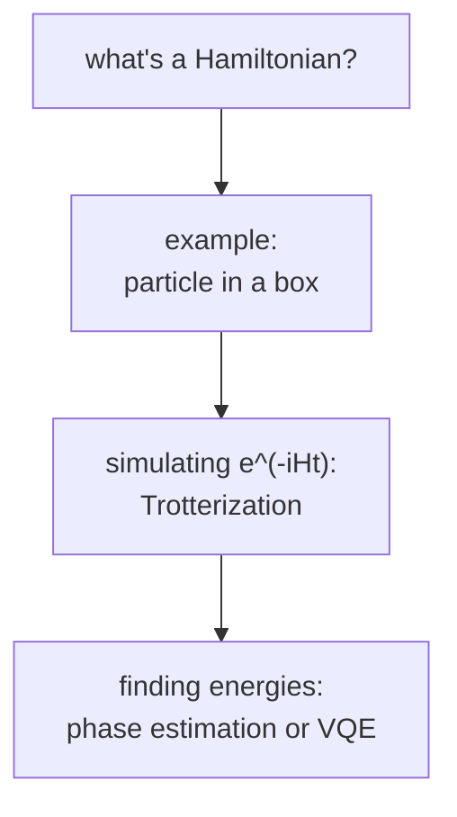

#quantum_simulation #hamiltonian #chemistry
Course 2, Week 3: **using quantum computers to simulate nature**. the original reason anyone wanted a quantum computer. (Course 3's version is [[Quantum simulation]])
## the idea
in **1980** Yuri **Manin** and in **1982** Richard **Feynman** noticed that simulating a quantum system on a normal computer takes time that grows **exponentially** with the number of particles. their fix: simulate it with another **quantum** system, which scales much better
> [!quote] Paul Dirac, 1929
> "The underlying physical laws necessary for the mathematical theory of a large part of physics and the whole of chemistry are thus completely known, and the difficulty is only that the exact application of these laws leads to equations much too complicated to be soluble."

- only a handful of quantum systems can be simulated efficiently on classical computers, and exact answers only work for **small** state spaces (small [[Hilbert space|Hilbert spaces]])
- big material simulations (a large chunk of the world's supercomputer time) need **approximations**, which bring errors and make many industrial predictions unreliable
- a big quantum computer handles huge Hilbert spaces **naturally**
## what people want to simulate

| field | examples |
|---|---|
| physics | magnetic materials (like in hard drives), electrons in **superconductors** (carry electricity with no loss) |
| chemistry | energy levels of atoms and molecules, what happens during a reaction |

> [!example] nitrogen fixation
> some bacteria turn nitrogen from the air into **ammonia** (NH₃) that plants can use, but we can't copy their trick efficiently. most fertilizer is still made by the **Haber–Bosch** process, which needs about **200 atmospheres** and **400 °C** and uses a huge amount of energy
>
> a 2017 paper worked out that a medium sized (error corrected) quantum computer could help understand the enzyme that bacteria use

## the challenges
- **size** of the problem you can fit → number of qubits
- **length** of the simulation you can run → coherence time and errors building up ([[NISQ]])
## 3 approaches

- **digital**: break the evolution into gates, see [[Hamiltonian simulation]] and [[Trotterization]]
- **analog**: eg. **ultra cold atoms** in optical traps, where you can control Bose–Einstein condensates and build time averaged Hamiltonians. (MERA and PEPS, which come up in the quiz, are **classical** tensor network simulation methods)
- **hybrid**: a classical computer steers the quantum device through its parameters to find eg. a minimum energy, see [[VQE]]
## this week's notes

- [[Hamiltonian]] → the energy operator that controls how a quantum system changes
- [[Particle in a box]] → the classic example you can solve by hand
- [[Hamiltonian simulation]] → the general problem of running $e^{-iHt}$ on a quantum computer
- [[Trotterization]] → splitting a hard Hamiltonian into easy pieces
- [[Quantum Phase Estimation#finding energies (Course 2 Week 3)|phase estimation for energies]] → precise, but needs deep circuits
- [[VQE]] → rough but works on today's noisy machines
## papers from the course

| paper | what they did |
|---|---|
| O'Malley et al. 2016, *Scalable Quantum Simulation of Molecular Energies* | energy curve of **H₂** on superconducting qubits, with both VQE and phase estimation (used for the example in [[VQE]]) |
| Kandala et al. 2017, *Hardware-efficient VQE for Small Molecules and Quantum Magnets* | VQE on up to **6 qubits** with 100+ Pauli terms, molecules up to **BeH₂** (IBM) |
| Zhang et al. 2017, *Observation of a Many-Body Dynamical Phase Transition with a 53-Qubit Quantum Simulator* | an **analog** simulator of **53 trapped ions** studying a phase transition in the transverse field Ising model of magnetism |

see also [[Quantum simulation]], [[NISQ]], [[VQE]]
