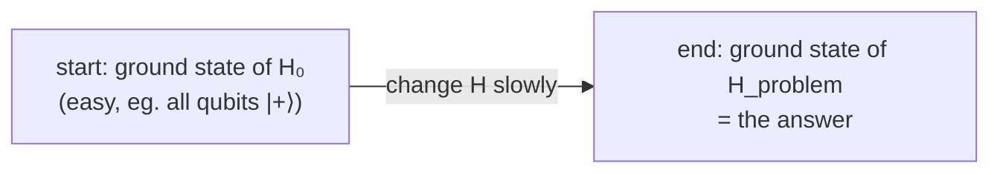

#adiabatic #AQC #optimization #hamiltonian
**AQC**: turn a problem into "find the **ground state** (lowest energy state) of a Hamiltonian", then get there by changing a Hamiltonian **slowly**. part of [[Quantum optimization]]
## history
- proposed by Edward **Farhi**, Jeffrey Goldstone, Sam Gutmann and Michael Sipser in **2000**
- in **2004** Dorit **Aharonov** and colleagues showed it's **polynomially equivalent** to the normal gate based (circuit) model, so it's **universal**
- it's a form of **analog** quantum computing
## the adiabatic theorem
> [!important] adiabatic theorem
> ==a system in its **lowest energy state** stays in the lowest energy state if its [[Hamiltonian]] is changed **slowly enough**==

## how AQC uses it
$$
H(s)=(1-s)\,H_0+s\,H_{\text{problem}}\qquad s=\frac tT\text{ goes from }0\text{ to }1
$$
^adiabatic-path

an adiabatic algorithm is 3 choices (none are unique, except maybe the problem Hamiltonian)
1. **initial Hamiltonian** $H_0$: known ground state, easy to make. eg. a big field along $x$ on every qubit, so they all start in $|+\rangle$
2. **problem Hamiltonian**: the problem **embedded** onto the hardware, within the limits of which qubits can interact
3. **evolution path**: how you go from one to the other, ideally slowly enough for the adiabatic theorem

these choices decide how fast you can go, ie. the **run time**. going faster than the theorem allows lowers the chance of getting the right answer. small adiabatic algorithms for search, factoring and optimisation have been run with nuclear spins (NMR), superconducting qubits and photons
## the catch: the minimum gap
as $s$ goes from 0 to 1, the ground state and first excited state come close at some point (an **avoided crossing**, close but not touching). that's where the system stops looking like $H_0$ and starts looking like $H_{\text{problem}}$, basically a **phase transition**
![[Adiabatic_gap.png]]
(my simulation of a random 4 qubit problem: the gap gets down to $\Delta\approx0.33$, and you need a run time of roughly $T\sim\frac1{\Delta^2}$ or longer to reliably end up with the answer)
> [!danger] why it fails for big problems
> the gap gets **smaller** as problems get bigger, which causes 2 problems
> 1. **Landau–Zener transitions**: go through the gap too fast and the system **jumps** to the excited state. avoiding this means going slower and slower, so the computation takes longer
> 2. **noise**: once the gap is smaller than the thermal energy $k_BT$, heat from the environment (and noise from the control fields) kicks the system out of the ground state anyway
>
> so for problems of practical size, staying in the ground state the whole way is basically impossible

> [!note] is it "several constant Hamiltonians"?
> no, the Hamiltonian changes **continuously** from $H_0$ to $H_{\text{problem}}$. (the digital version, [[QAOA]], is the one that uses separate fixed steps)

## so what if it leaves the ground state?
in **1998** Tadashi Kadowaki and Hidetoshi Nishimori proposed a machine that uses **quantum tunnelling** and **dissipation** to find its way back down after passing the gap → [[Quantum annealing]]

see also [[Quantum annealing]], [[QAOA]], [[Hamiltonian]], [[Quantum optimization]]
