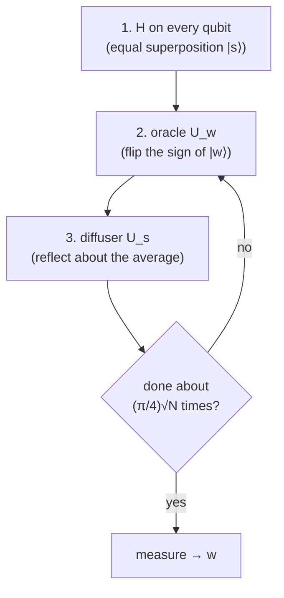

#grover #quantum_search #oracle #amplitude_amplification
find the **marked item** in an **unstructured** list of $N$ items in about $\sqrt N$ steps instead of $N$. the Week 4 lab (done in [[QASM]]). part of [[Quantum optimization]]
## the problem
a function $f$ that says "yes" only for the one item $w$ you're looking for
$$
f(x)=\begin{cases}1&x=w\\0&x\ne w\end{cases}
$$
classically you have to check items one by one: about $\frac N2$ tries on average, $N$ in the worst case
## setup
$N$ items need $n=\log_2N$ qubits, with item $x$ stored as the basis state $|x\rangle$ in binary

eg. $N=4$ → 2 qubits: $0\to|00\rangle,\ 1\to|01\rangle,\ 2\to|10\rangle,\ 3\to|11\rangle$
> [!example] how many qubits for $N=512$?
> $\log_2512=9$ qubits (not 512!)

## the 3 steps

1. **initialise**: [[Hadamard Gate|Hadamards]] make the equal superposition $|s\rangle=\frac1{\sqrt N}\sum_x|x\rangle$
2. **oracle** $U_w$: does nothing to every state except the marked one, which gets a **minus sign**: $U_w|x\rangle=(-1)^{f(x)}|x\rangle$. this is the **first reflection**
3. **diffuser** $U_s=2|s\rangle\langle s|-I$: the **second reflection**. it flips every amplitude around the **average**, so the one negative amplitude shoots up and the rest shrink

one oracle + one diffuser = one **Grover iteration**
## why it works (2 reflections = a rotation)
think of the state as an arrow in the plane spanned by $|w\rangle$ and "everything else"
- it starts almost along "everything else", at a small angle $\theta$ above it, where $\sin\theta=\frac1{\sqrt N}$
- 2 reflections = a **rotation** by $2\theta$ towards $|w\rangle$
- after $k$ iterations the chance of measuring $w$ is
$$
P_k=\sin^2\big((2k+1)\theta\big)
$$
so you need about $k\approx\frac\pi4\sqrt N$ iterations to point (almost) straight at $|w\rangle$
![[Grover_iterations.png]]

| $N$ | qubits | best number of iterations | chance of success |
|---|---|---|---|
| 4 | 2 | 1 | 100% |
| 8 | 3 | 2 | 94.5% |
| 512 | 9 | 17 | 99.9% |

(checked numerically)
> [!warning] don't overshoot
> ==it's a rotation, so doing **more** iterations than needed rotates **past** $|w\rangle$ and the chance goes back down (see the right side of the plot)==

## oracle examples

| marked item | oracle |
|---|---|
| $\lvert11\rangle$ (2 qubits) | a [[CZ gate]] (flips the sign only when both are 1) |
| $\lvert101\rangle$ (3 qubits) | X on the middle qubit, then a controlled-controlled-Z, then X again (turns $\lvert101\rangle$ into $\lvert111\rangle$ for a moment) |

the CZ really does only flip $|11\rangle$, look at the bottom right of its matrix
![[CZ gate#^matrix]]

the full 2 qubit circuit is in [[QASM#Grover in QASM]]
## how good is it?
- a **quadratic** speedup ($\sqrt N$ vs $N$), not exponential like [[Shor's algorithm]]. that's why the week calls it a "polynomial-speedup" algorithm
- it's been proven that **no** quantum algorithm can do unstructured search faster, so $\sqrt N$ is the best possible
- it can speed up any problem where you can **check** an answer quickly: search, some optimisation, and brute force key guessing (which is why it only halves the security of symmetric keys, see [[Modern cryptography#what quantum computers change]])

see also [[QASM]], [[Quantum optimization]], [[Hadamard Gate]], [[CZ gate]]
