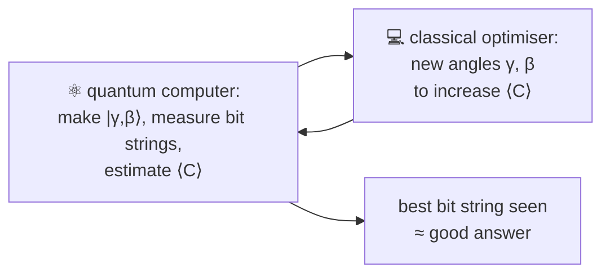

#QAOA #optimization #hybrid_algorithm #combinatorial_optimization
**Quantum Approximate Optimization Algorithm** (Eddie Farhi and colleagues): a gate based, hybrid way to find **good** (not necessarily best) answers to combinatorial problems. part of [[Quantum optimization]]
## combinatorial optimisation
- $n$ bits $z=z_1z_2\ldots z_n$, so $2^n$ possible bit strings
- $m$ **clauses** $C_\alpha(z)$, each a yes/no (Boolean) constraint on some of the bits: $1$ if $z$ satisfies it, $0$ if not
- the **objective function** counts how many are satisfied
$$
C(z)=\sum_{\alpha=1}^mC_\alpha(z)
$$
- the best answer is the $z$ with the biggest $C(z)$ (if all clauses are satisfied, $C=m$, but that's not required)

finding the best $z$ is generally **hard**, but a high quality **approximate** answer is often enough and can be found faster
## the 2 operators
the cost function gets "promoted" to an operator $C$ (diagonal: it just multiplies each $|z\rangle$ by $C(z)$), plus a "mixing" operator $B=\sum_jX_j$
$$
U(C,\gamma)=e^{-i\gamma C}\qquad U(B,\beta)=e^{-i\beta B}=\prod_je^{-i\beta X_j}
$$
- $U(C,\gamma)$: rotates around $z$, by an amount depending on the clauses. eg. a clause "$z_j\ne z_k$" gives a phase only when qubits $j$ and $k$ are **opposite**
- $U(B,\beta)$: rotates **every** qubit around $x$ by angle $\beta$ (states along $x$ don't change)
## the algorithm
start in $|s\rangle=|+\rangle^{\otimes n}$ (every bit string equally likely, all spins along $x$, **not** all pointing down), then alternate $p$ times
$$
|\gamma,\beta\rangle=U(B,\beta_p)\,U(C,\gamma_p)\cdots U(B,\beta_1)\,U(C,\gamma_1)\,|s\rangle
$$

- more layers $p$ = better answers. as $p\to\infty$ it can always reach the best one (it turns into a digital version of [[Adiabatic quantum computing]])
- how well it does in practice depends a lot on how good the quantum hardware is
## example: MaxCut on a ring of 4
**MaxCut**: colour each node of a graph black or white to **cut** as many edges as possible (an edge is cut if its 2 ends differ). each edge is a clause $C_{jk}=\frac12(1-Z_jZ_k)$

for a ring of 4 nodes the best is $4$ (alternate the colours), a random guess cuts $2$ on average
![[QAOA_landscape.png]]
(my simulation with $p=1$: the best angles give $\langle C\rangle=3.00$, ie. 75% of the best possible, and measuring gives the perfect cut $0101$ or $1010$ about **53%** of the time, vs $\frac2{16}=12.5\%$ for random guessing. checked numerically)
> [!warning] what QAOA does NOT promise
> - it doesn't always find the **best** answer
> - it does **not** always beat classical algorithms. whether it gives a real advantage on useful problems is still being researched

see also [[VQE]] (the same hybrid loop, for chemistry), [[Adiabatic quantum computing]], [[Quantum optimization]]
